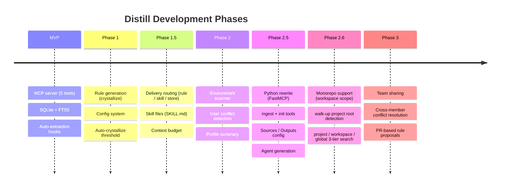

# Distill Roadmap

---

## MVP (Pre-Phase 1) ✓

- [x] MCP server, 5 tools (learn, recall, profile, digest, memory)
- [x] SQLite + FTS5 store (global/project dual scope)
- [x] .jsonl parser + transcript truncation
- [x] Rename "oh-my" prefix to "distill"
- [x] Extraction criteria redesign: unidirectional → bidirectional Decision Signals
- [x] Remove Korean examples, adopt semantic-based detection
- [x] PreCompact/SessionEnd auto-extraction hook (`distill_hook.py`)
- [x] Python rewrite — FastMCP + fastembed + sqlite-vec + Pydantic v2 (241 tests)

## Phase 1: Rule Generation & Evolution ✓

- [x] Config system — per-module model selection (`.distill/config.json`)
- [x] Extraction prompt context preservation (conclusion + WHY reasoning)
- [x] Crystallize action — consolidate chunks into `distill-*.md` rule files
- [x] Conflict detection — inject existing rules as context during extraction
- [x] Auto-crystallize threshold — trigger crystallize after N new chunks
- [x] `distill_meta` table for tracking crystallize timestamps
- [x] Unit tests — 65 tests covering all Phase 1 modules
- [x] MCP Sampling refactoring — remove API key dependency, use `ctx.sample()`
- [x] MCP Sampling tests — mock server, callLlm, extractKnowledge, crystallize, hook tests (+42 tests)

**Key decisions:**

| Decision | Reasoning |
|----------|-----------|
| Per-module model selection | Haiku for frequent extraction (fast/cheap), Sonnet for infrequent crystallize (quality) |
| Config file (`.distill/config.json`) | Zero-config defaults, global → project merge priority |
| Manual + threshold auto-trigger for crystallize | Balances user control with automation |
| Conflict detection during extraction | Single Haiku call handles both extraction and conflict detection (no extra LLM call) |

---

## Phase 1.5: Knowledge Routing & Context Budget ✓

- [x] Graduation Logic — Three-tier delivery classification (rule/skill/store)
- [x] Schema Extension — delivery, downgrade action, skill_metadata, config thresholds
- [x] Prompt Engineering — Delivery classification section in CRYSTALLIZE_SYSTEM_PROMPT
- [x] Skill File Writer — SKILL.md format with frontmatter `disable-model-invocation: true`
- [x] Delivery Actions — Route by delivery type, handle downgrade action
- [x] Tool Integration — Report downgraded + skills_created in memory/learn tools
- [x] Unit Tests — 8 new parsing tests for graduation logic validation

**Key decisions:**

| Decision | Reasoning |
|----------|-----------|
| Single LLM call | Extend existing crystallize prompt (no two-stage pipeline) for efficiency |
| Skill format | Claude Code SKILL.md convention with `disable-model-invocation: true` frontmatter |
| Store-only routing | No file output, accessible via `recall()` tool |
| Config thresholds | `rule_confidence_threshold: 0.7`, `rule_budget_max_files: 5` (zero-config defaults) |
| Backward compatibility | Config optional, new report fields additive, no breaking changes |

---

## Phase 2: User Environment Awareness ✓

**Goal**: Understand the user's entire `.claude/` setup (not just Distill-generated rules) and detect conflicts.

### Core Tasks

- [x] `.claude/` environment scanner — collect inventory of rules, skills, agents (`src/distill/scanner/`)
- [x] Full user rule context during extraction (Distill rules + user rules)
- [x] Crystallize user conflict awareness — suggest (not auto-edit) when conflicting with user rules
- [x] Profile environment summary — rule/skill/agent counts, token estimation, budget usage
- [x] Tool report updates — display user rule conflicts in crystallize reports
- [x] Unit tests for all Phase 2 modules (26 new tests, total 151)
- [x] Documentation updates (CLAUDE.md, architecture)

### Resolved Questions

| Question | Answer |
|----------|--------|
| Allow direct modification of user rules? | No — Distill only modifies `distill-*.md`, suggests conflicts for user rules |
| Inventory caching strategy? | No caching — `.claude/` is small (<50 files, <5ms scan) |
| Scanner as separate module or extend rules-reader? | Separate `src/distill/scanner/` module — broader responsibilities |

---

## Phase 2.5: Knowledge Store Configuration ✓

**Goal**: Make knowledge sources and output behavior fully configurable. Enable docs/wiki ingestion.

- [x] `SourcesConfig` — control which sources feed the knowledge store (transcripts, rules, skills, agents, dirs)
- [x] `OutputsConfig` — per-type settings for rules/skills/agents (thresholds, budget, split)
- [x] `ingest(path)` tool — markdown/text directory → LLM extraction → SQLite (mtime-based cache)
- [x] `init()` tool — one-step onboarding: create config, scan env, ingest configured dirs
- [x] Rule splitting — LLM decides when `split_threshold_tokens` exceeded (topic cohesion)
- [x] Skill classification criteria — 3+ procedural steps with clear trigger → skill
- [x] Agent generation — `outputs.agents.enabled` + 3+ related skills in repeating workflow
- [x] SessionStart hook — auto-learn pending extractions
- [x] 14 new tests (test_ingest.py, test_init.py), total 241 tests

### Deferred

- [ ] E2E simulation — run full pipeline with real `.jsonl` transcripts
- [ ] Analyze relationships between decisions and skills/agents
- [ ] Staleness decay — rules with 0 `access_count` after N sessions demoted to store
- [ ] Context budget dashboard — token counting + visualization
- [ ] Graduation thresholds — promote to rule after N accesses

---

## Phase 2.6: Monorepo / Workspace Scope ✓

**Goal**: Support multi-package monorepos with per-package and shared knowledge.

### Core Tasks

- [x] `detect_project_root()` walk-up — traverse from CWD to filesystem root, return nearest marker
- [x] `workspace` scope — `.git` root as shared monorepo knowledge layer
- [x] 3-tier scope resolution: `project` → `workspace` → `global`
- [x] `recall()` searches all three scopes simultaneously
- [x] `learn()` / `ingest()` store to nearest scope (project if exists, else workspace)
- [x] `KnowledgeScope` type update: add `"workspace"`
- [x] `for_each_scope()` helper handles 3-tier iteration
- [x] `pyproject.toml` added to project root markers
- [x] `VALID_SCOPES` in extractor updated to include workspace
- [x] `load_config()` accepts workspace_root (priority: project > workspace > global)
- [x] Stepwise promote/demote: `project ↔ workspace ↔ global`
- [x] 269 tests passing

### Key Decisions

| Decision | Reasoning |
|----------|-----------|
| Walk-up root detection | CWD-only detection fails for monorepo subpackages |
| Workspace scope = `.git` root | Natural monorepo boundary; always present |
| 3-tier not 2-tier | Packages share team conventions (workspace) but also have package-specific rules (project) |
| Nearest marker wins for project scope | Subpackage with `pyproject.toml` gets its own `.distill/`; without one, falls through to workspace |

---

## Phase 2.7: Domain Model Improvements (planned)

**Goal**: Clarify domain concepts that are currently conflated.

- [ ] **Proposal #2 — Scope separation**: `KnowledgeScope` conflates physical storage tier with semantic visibility. Add `visibility` field (`global | workspace | project | private`) to `KnowledgeChunk`. Allow `recall()` to filter by visibility independently of storage scope.
- [ ] **Proposal #4 — Lifecycle tracking**: `KnowledgeSource` only records extraction event. Add `lifecycle_events` table to track promote/demote/crystallize transitions with timestamps.
- [ ] **Proposal #6 — Chunk relations**: crystallize processes a flat chunk list with no inter-chunk relationships. Add `chunk_relations` table (`refines | contradicts | depends_on | supersedes`) populated by LLM during crystallize.

---

## Phase 3: Team Sharing

**Goal**: Mechanism to promote personal rules to team-wide rules.

- [ ] Whether to git-commit project-scope Distill rules (applies to entire team)
- [ ] Cross-member conflict resolution: A prefers X, B prefers Y — consensus mechanism
- [ ] PR-based proposals: crystallize → rule file change → create PR → team review
- [ ] Personal vs team rule separation (personal overrides on same topic?)

### Monetization Considerations (by monetization-analyst persona)

These are architectural trade-offs to be aware of if monetization becomes a future goal:

| Design Decision | Monetization Impact |
|----------------|---------------------|
| MIT license | Allows unrestricted commercial use and self-hosting — no license-based revenue |
| SQLite local storage | Users own their data and can fork easily — no SaaS lock-in |
| MCP Sampling primary path | Claude subscription users never pay for Distill-specific LLM usage |
| Zero-config defaults | Conflicts with freemium paywalls that gate features |

**Realistic monetization path** (if pursued): Value-add hosted service (team knowledge sync, conflict resolution UI, analytics dashboard) that complements but doesn't replace the OSS tool. Current architecture should be considered "monetization-resistant by design."

**Potential tiers** (if hosted service):
- Free: BYOK (bring your own key), local-only
- Pro: LLM quota included, cloud backup
- Team: Shared knowledge sync, cross-member conflict resolution (Phase 3)

---

## Decision Log

| Decision | Reasoning |
|----------|-----------|
| Personal-first approach | Team sharing mechanism has high complexity; validate with personal use first |
| No Entire integration needed | Distill hook already operates independently from Claude Code events |
| Phase 1: detect conflicts in Distill rules only | Full `.claude/` environment awareness deferred to Phase 2 |
| Bidirectional Decision Signals | Unidirectional (user→AI corrections only) misses AI→user corrections |
| Semantic-based detection | Keyword matching fails in multilingual conversations; semantic approach is universal |
| Per-module model separation | Different quality/cost tradeoffs per pipeline stage |
| Knowledge routing | Rules are always-loaded context; uncontrolled growth degrades performance. Route by delivery mechanism based on knowledge type and frequency |
| MCP Sampling over API key | Claude Max/Teams users shouldn't need separate API credits. MCP sampling uses existing subscription via `ctx.sample()` |
| Commands deprecated → Skills | Claude Code deprecated commands (merged into skills). Skills support frontmatter (`disable-model-invocation: true`) for user-only invocation |
| Phase 2 scope: environment only | Wiki ingestion deferred to Phase 2.5 — independent feature with own prompt/schema/tests |
| No caching for scanner | `.claude/` is small (<50 files), fresh scan avoids staleness risk |
| Scanner as separate module | Broader responsibility than rules-reader; clean separation of concerns |
| Python rewrite | FastMCP provides first-class `ctx.sample()` + Pydantic validation; fastembed enables local vector embeddings without API keys |
| Monorepo workspace scope | Monorepo packages share team conventions but need independent knowledge too; `.git` root as natural workspace boundary |
