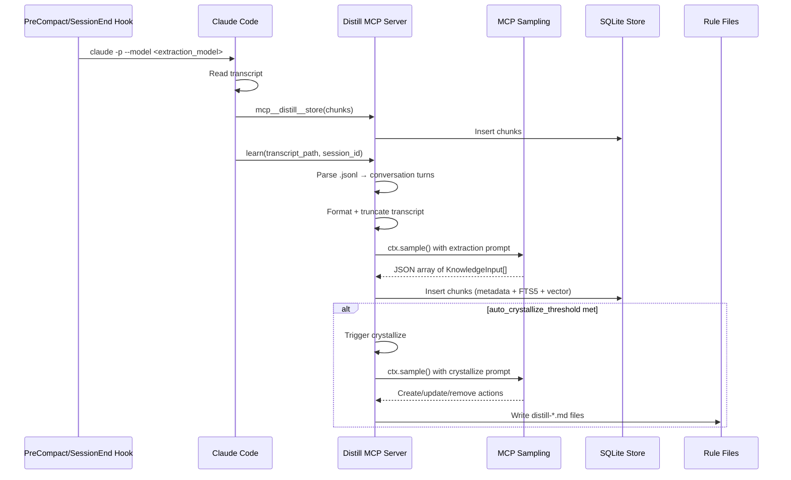
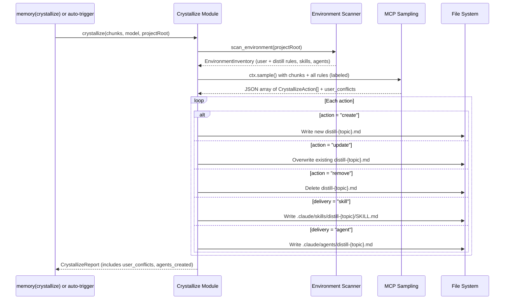
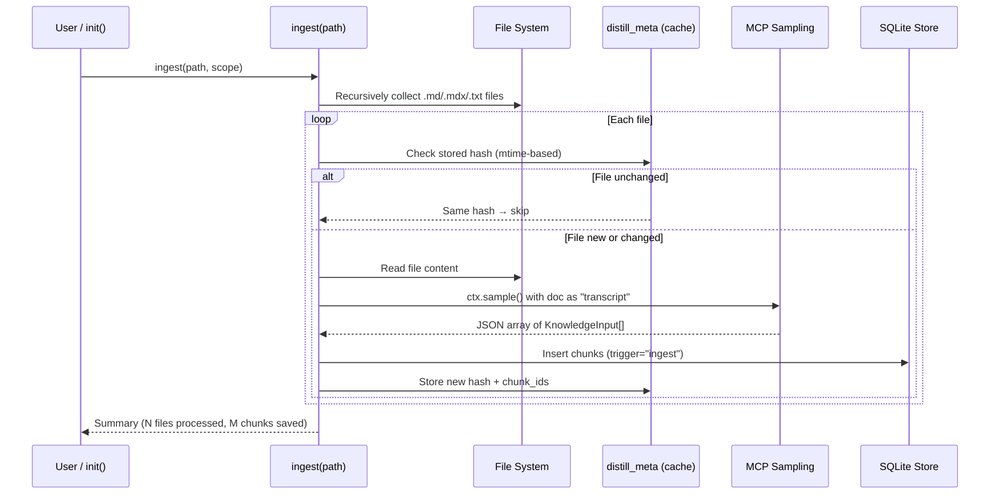

# Architecture

Distill is structured in six layers: **Store**, **Scanner**, **Extractor**, **Tools**, **Hooks**, and **Rules**.

## System Overview

```mermaid
graph TB
    CC[Claude Code] <-->|MCP Protocol| MCP[Distill MCP Server]
    MCP -->|recall / learn / profile / digest / memory / ingest / init / test_raw_sampling / store| Tools[Tools Layer]
    Tools --> Store[(SQLite + FTS5 + sqlite-vec)]
    Tools -->|ctx.sample()| Sampling[MCP Sampling]
    Sampling -->|LLM response| Tools
    Tools --> Rules[".claude/rules/distill-*.md"]
    Tools --> Skills[".claude/skills/distill-*/SKILL.md"]
    Tools --> Agents[".claude/agents/distill-*.md"]

    Hook1[PreCompact / SessionEnd Hook] -->|claude -p| Store

    style CC fill:#f3e8ff,stroke:#7c3aed
    style MCP fill:#dbeafe,stroke:#2563eb
    style Store fill:#fef3c7,stroke:#d97706
    style Rules fill:#dcfce7,stroke:#16a34a
    style Skills fill:#dcfce7,stroke:#16a34a
    style Agents fill:#dcfce7,stroke:#16a34a
```

## Learn Pipeline



## Crystallize Pipeline



## Ingest Pipeline



## LLM Call Architecture

Distill uses two paths for LLM calls depending on context:

### Path 1: MCP Sampling (tools)

`learn()`, `ingest()`, `crystallize()` use `call_llm()` in `src/distill/extractor/llm_client.py`:

- Uses MCP Sampling (`ctx.sample()`) — routes through the user's Claude subscription, no API key needed.
- `ctx` is always available when called as an MCP tool from Claude Code.
- If `ctx` is not available, raises `RuntimeError`.

```python
# llm_client.py — simplified
async def call_llm(*, ctx, model, messages, system_prompt, ...) -> str:
    if ctx is None:
        raise RuntimeError("MCP Sampling context required")
    return await ctx.sample(...)
```

### Path 2: claude -p subprocess (hooks)

Hooks run outside the MCP server process and use `claude -p` subprocess:

1. Hook spawns `claude -p "<prompt>" --model <extraction_model> --allowedTools mcp__distill__store,Read --mcp-config <distill-server-json>`
2. Claude reads the transcript with the Read tool, extracts knowledge as JSON
3. Calls `mcp__distill__store(chunks=[...], session_id=...)` to persist
4. Extraction happens immediately at session end — no deferred handoff needed

## Layers

### Store (`src/distill/store/`)

| File | Responsibility |
|------|---------------|
| `types.py` | `KnowledgeEntry`, `KnowledgeInput`, `KnowledgeSource` — type/scope/trigger enums |
| `scope.py` | Resolve storage paths (3-tier: global/workspace/project), walk-up root detection (`detect_project_root()`, `detect_workspace_root()`) |
| `metadata.py` | `MetadataStore` — SQLite CRUD (insert, search, touch, delete, stats, meta key-value) |
| `vector.py` | `VectorStore` — FTS5 full-text search + sqlite-vec semantic search (fastembed embeddings) |

**SQLite Schema:**
- `knowledge` table with CHECK constraints on `type`, `scope`, `trigger`
- `distill_meta` table for key-value metadata (e.g., `last_crystallize` timestamp, ingest file hashes)
- Indexes on `scope`, `type`, `project`
- FTS5 virtual table `knowledge_fts` for full-text search
- `vec_items` table for vector embeddings (sqlite-vec)
- WAL journal mode for concurrent reads

### Scanner (`src/distill/scanner/`)

| File | Responsibility |
|------|---------------|
| `types.py` | `EnvironmentItem`, `EnvironmentInventory`, `EnvironmentSummary`, origin/type enums |
| `scanner.py` | `scan_environment()` — scan `.claude/` dirs (global + project) for rules, skills, agents |

The scanner reads the full `.claude/` environment:
- **Rules**: `*.md` in `.claude/rules/` — classified as `distill` origin (prefix `distill-*`) or `user` origin
- **Skills**: `*/SKILL.md` in `.claude/skills/` — classified by directory name prefix
- **Agents**: `*.yaml`/`*.yml` in `.claude/agents/` — all `user` origin
- Fresh scan every call (no caching — `.claude/` is small, <5ms)

### Extractor (`src/distill/extractor/`)

| File | Responsibility |
|------|---------------|
| `parser.py` | Parse `.jsonl` transcripts into user/assistant turn pairs |
| `prompts.py` | System + user prompt templates for extraction and crystallize |
| `extractor.py` | Orchestrate: parse → format → truncate → MCP sampling → validate → return `KnowledgeInput[]` |
| `crystallize.py` | Consolidate knowledge chunks into rule/skill/agent files via MCP sampling, detect user rule conflicts |
| `rules_reader.py` | Read rules from global + project scopes (delegates to scanner) |
| `sampling_error.py` | Wrap MCP sampling errors with user-friendly messages |

**Per-module model selection:**
- Extraction: Haiku (fast, cheap — runs frequently)
- Crystallize: Sonnet (higher quality — runs infrequently)

**Max transcript size:** 100K characters (truncated from the beginning, keeping recent turns)

### Tools (`src/distill/tools/`)

| Tool | Input | Behavior |
|------|-------|----------|
| `init` | `scope?` | Create config, install skills, scan environment, return onboarding report |
| `recall` | `query`, optional `type`/`scope`/`limit` | Vector + FTS5 hybrid search both scopes, sort by confidence |
| `learn` | `transcript_path`, `session_id`, optional `scope` | Extract + save + auto-crystallize if threshold met (requires LLM) |
| `store` | `chunks`, `session_id`, optional `trigger`/`scope` | Save pre-extracted chunks directly — no LLM (used by `claude -p` subprocess) |
| `profile` | optional `scope` | Stats per scope + `.claude/` environment summary (rules, skills, agents, budget) |
| `digest` | none | Duplicate detection (Jaccard > 0.7), stale entries |
| `memory` | `action`, `id?` | promote/demote/delete/crystallize |
| `ingest` | `path`, optional `scope` | Markdown/text dir → LLM extraction → store (mtime-based cache) |
| `test_raw_sampling` | none | Test MCP sampling connectivity (diagnostic) |

### Hooks (`src/distill/hooks/`)

| File | Responsibility |
|------|---------------|
| `distill_hook.py` | PreCompact/SessionEnd: extraction via `claude -p --model` subprocess |

**Hook flow:**
1. PreCompact/SessionEnd fires → `distill_hook.py` runs
2. Loads config to get `extraction_model` (default: haiku)
3. Runs `claude -p --model <extraction_model>` subprocess → Claude reads transcript + calls `mcp__distill__store()`

Hooks run outside the MCP server process and cannot use `ctx.sample()`. The `claude -p` subprocess enables immediate extraction without requiring an API key.

### Config (`src/distill/config.py`)

Config file: `.distill/config.json` (project) or `~/.distill/config.json` (global).
Project config overrides global. All fields optional (zero-config).

| Field | Default | Purpose |
|-------|---------|---------|
| `extraction_model` | `claude-haiku-4-5-20251001` | Model hint for extraction |
| `crystallize_model` | `claude-sonnet-4-5-20250929` | Model hint for crystallize |
| `max_transcript_chars` | `100000` | Transcript truncation limit |
| `auto_crystallize_threshold` | `0` (disabled) | Auto-crystallize after N new chunks |
| `sources.transcripts` | `true` | Include .jsonl transcripts as source |
| `sources.rules` | `true` | Inject existing rules as LLM context |
| `sources.skills` | `true` | Inject existing skills as LLM context |
| `sources.agents` | `false` | Inject existing agents as LLM context |
| `sources.dirs` | `[]` | Directories to ingest via `ingest()` or `init()` |
| `outputs.rules.enabled` | `true` | Generate `distill-*.md` rule files |
| `outputs.rules.budget_max_files` | `5` | Max rule files (context budget) |
| `outputs.rules.confidence_threshold` | `0.7` | Min confidence for rule promotion |
| `outputs.rules.split_threshold_tokens` | `500` | Split rule file when it exceeds this size |
| `outputs.skills.enabled` | `true` | Generate `SKILL.md` skill files |
| `outputs.skills.confidence_threshold` | `0.6` | Min confidence for skill promotion |
| `outputs.agents.enabled` | `false` | Generate `.claude/agents/distill-*.md` files |
| `outputs.agents.min_skills_to_merge` | `3` | Min related skills to trigger agent generation |

## Rule File Format

Crystallize generates rule files in `.claude/rules/distill-{topic}.md`:

```markdown
# {topic}

> Auto-generated by Distill. Do not edit manually.

- Rule 1
- Rule 2

## Sources

- chunk-id-1
- chunk-id-2
```

These files are automatically loaded by Claude Code as rules context.

## Storage Structure

```
~/.distill/
├── config.json                # Global config (optional)
├── knowledge/                 # Global scope
│   ├── metadata.db            # SQLite database
│   └── metadata.db-wal        # WAL file

<git-root>/                    # Workspace root (.git present)
└── .distill/
    ├── config.json            # Workspace config (optional, overrides global)
    └── knowledge/             # Workspace scope (shared monorepo conventions)
        ├── metadata.db
        └── metadata.db-wal

<project>/                     # Project root (pyproject.toml / package.json / CLAUDE.md)
├── .distill/
│   ├── config.json            # Project config (optional, overrides workspace+global)
│   └── knowledge/             # Project scope
│       ├── metadata.db
│       └── metadata.db-wal
└── .claude/
    ├── rules/
    │   └── distill-*.md       # Generated rule files
    ├── skills/
    │   └── distill-*/
    │       └── SKILL.md       # Generated skill files
    └── agents/
        └── distill-*.md       # Generated agent files (if enabled)
```

## Dependencies

| Package | Purpose |
|---------|---------|
| `fastmcp` | FastMCP server implementation + sampling (`ctx.sample()`) |
| `pydantic` | Config and schema validation |
| `fastembed` | Local vector embeddings (no API key) |
| `sqlite-vec` | SQLite vector extension for semantic search |
| `sqlite3` | SQLite with FTS5 support (Python stdlib) |
