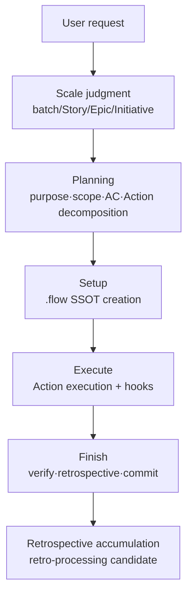

# flow — Flow Planner Plugin

Initiative/Epic/Story/Action flow **Planner** — a library of playbooks for how AI works + a self-improvement system. The flow only knows "how to plan"; "what to build" is determined by the project context.

> Composed of procedural skills, hooks, rules, playbooks, and commands (`/flow-config` · `/flow-config-retro` · `/flow-status` · `/flow-help` · `/flow-upgrade` · `/skill-stats` · `/skill-stats-clear` · `/team-skill-stats`).

---

## What it does

A system where AI **plans work across the 4-layer Initiative / Epic / Story / Action** structure, executes autonomously, and **evolves to work better and better through retrospectives**.



- **Only knows "how to plan"** — the procedures, quality gates, and retrospective mechanism are provided by the plugin.
- **Does not know "what to build"** — language, framework, and implementation are supplied by the project via playbooks·agents in `.flow/settings.json`. Thanks to this, the same plugin works on any stack.
- **North Star** — AI understands the purpose and checks for itself whether that purpose has been reached.

5 component types (roles separated MECE):

| Asset | Role |
|------|------|
| **skills** (32) | Planning·execution·retrospective procedures — the `flow` orchestrator `Read`s the per-phase `flow-*` skills |
| **hooks** (4 events + CLI) | Quality gates — enforce code edits·commits·merges at the system level (cannot be bypassed). The quality-gate adapter (`quality_gate_cli.py`) additionally calls, records, and minimally blocks on the project-declared checks (settings `checks` — free-form names) at the verification stage |
| **rules** (11) | Always-applied text rules — synced to `.claude/rules/` (`/flow-upgrade` is the sync SSOT, config delegates the call). `flow-rules.md` covers the 12 hook-enforced rule kinds plus the text rules |
| **playbooks** (12) | Ways of working per task type (feature/refactor/bug/docs/research/qa/security/deploy/usecase-extraction/retro-processing/plugin-dev/general) — pick 1 per task. RT (Red Team) runs default-on at the review gate |
| **commands** (8) | `/flow-config` · `/flow-config-retro` · `/flow-status` · `/flow-help` · `/flow-upgrade` (rule propagation) · `/skill-stats` · `/skill-stats-clear` · `/team-skill-stats` |

> VS Code Copilot compatibility: hooks recognize not only Claude Code's `Write/Edit/Bash` but also VS Code's `create_file` / `replace_string_in_file` / `apply_patch` / `run_in_terminal` as aliases. In particular, `apply_patch` parses the file paths inside the patch so the Action-document·playbook·purpose-field gates do not fail open.

> 📖 More:
> - **[docs/ARCHITECTURE.md](docs/ARCHITECTURE.md)** — full architecture / component details / execution flow
> - **[docs/USAGE.md](docs/USAGE.md)** — how to use (configure → plan → execute → finish → improve + troubleshooting)
> - **[docs/SKILLS.md](docs/SKILLS.md)** — behavior reference for the 32 skills (trigger/what it does/I·O/mechanism)
> - **[CONCEPTS.md](CONCEPTS.md)** — provisional agreements·unverified items of the core concepts

---

## Quick start

```
/flow-config      # inject .flow/settings.json (AI understands the project + configures via conversation) — initial setup + re-tuning
```

Details: `commands/flow-config.md`.

## VS Code Copilot cache freshness

VS Code Copilot Chat keeps the plugin in a Git marketplace cache such as `~/.vscode/agent-plugins/github.com/noory-code/noory-ai`. If this cache lags behind `origin/main`, `/flow-upgrade` may mistake outdated `flow` rules for the latest canonical source.

Staleness detection (the SessionStart hook and `/flow-upgrade` Step 0) identifies the environment from `${CLAUDE_PLUGIN_ROOT}` and compares the installed plugin version against the cache's current `origin/main` ref (`git show` — zero network, no fetch). Two consequences for VS Code:

- Auto-upgrade is CLI-only. In VS Code the plugin cannot run the upgrade itself — when the plugin is stale, the guidance is to `git pull` the marketplace repo manually, then run `Developer: Reload Window`.
- Because detection never fetches, a cache whose `origin/main` ref is itself outdated can pass as up to date. When in doubt, `git pull` the cache first.

After a pull in the VS Code cache, confirm in a new Copilot Chat session following `Developer: Reload Window` or a VS Code restart. Do not assume that a Git cache refresh alone makes the current session immediately re-read new command / skill / hook assets.

---

## Agent Teams — the foundation of Story execution (activation recommended)

This plugin maps onto Claude Code **Agent Teams** (experimental) — `shared task list` = work items / `hooks` = quality gates / `plan approval` = confirmation / `mailbox` = collaboration.

> **Positioning**: the recommended default is to run parallelizable waves across multiple agents; Agent Teams is the richest vehicle for it on Claude Code. Story = team scope (teammates persist for the duration of the Story) / Action = single-agent unit, and the main (lead) reads the Action dependency graph and schedules it into execution waves (independent = concurrent · dependent = next). Without Agent Teams (env inactive, or a non-Claude tool) the **same wave model still runs in parallel** — via parallel subagents (the Task tool) or the tool's own mechanism; a wave drops to serial only where dependencies force it. Procedure SSOT: `skills/flow` `### Lead scheduling decision layer (D3)`.

### env setup (user task)

Add to `.claude/settings.json`:

```json
{ "env": { "CLAUDE_CODE_EXPERIMENTAL_AGENT_TEAMS": "1" } }
```

> ⚠️ `_recommendedEnv` in `plugin.json` is **informational meta** — Claude Code does not directly apply the env from plugin.json. Actual activation = the `.claude/settings.json` setting above + a **session restart**.

### Without Agent Teams (env inactive, or a non-Claude tool)

When Agent Teams is inactive (or you are on a non-Claude tool such as Codex), the same work-item ↔ scheduling model still runs — with **parallel subagents (the Task tool) or the tool's own parallel mechanism** in place of the peer-to-peer team. Independent Actions in a wave still run **concurrently**; a wave drops to serial only where dependencies force it. The result is the same; only the coordination richness differs.

---

## Asset conflict resolution (name collisions — project override wins)

When a plugin asset and a project `.claude/` (or `.flow/`) asset have colliding names:

| Asset kind | Collision location | Priority | Notes |
|----------|----------|---------|------|
| **rules/** | plugin `rules/` → project `.claude/rules/` (created by `/flow-upgrade` sync, config delegates) | **generated file = plugin / hand-authored file = project** | ⚠️ Always loaded. Generated files (`DO NOT EDIT` marker) are overwritten on `/flow-upgrade` (plugin canonical) / hand-authored files are untouched |
| **playbooks/** | plugin `playbooks/` ↔ `.flow/playbooks/` | project wins | override (falls back to plugin default if absent) |
| **commands/** | plugin `commands/` ↔ project command | project wins | slash command |

> Conflict-resolution principle = **project override wins** (maximize use of the project context).

---

## Incremental adoption

You can run in parallel without cutting off existing assets (`.claude/`·in-progress work items) and replace them incrementally — after installing the plugin, use the plugin flow starting from new work. On conflict, behavior follows the **conflict-resolution principle** above (project override wins).

## Skill usage statistics (personal · team)

A feature that measures which skills are actually used, so that "cleaning up unused skills" is done on evidence rather than guesswork (absorbed the former `skill-usage`).

- **Automatic recording · on/off**: every time a skill is invoked it is recorded locally (`PreToolUse` hook) — to `~/.claude/skill-usage.jsonl`, or `~/.codex/skill-usage.jsonl` for Codex sessions (routed by the `turn_id` payload field). The config tool (`/flow-config`) puts `"skill_usage": { "enabled": true }` into `.flow/settings.json` during initial setup·update, so opening the file makes collection **visible** — to turn it off, change that value to `false` (on by default even if the entry is absent).
- **Personal stats**: `/skill-stats` — frequently used / unused skills.
- **Team aggregation (monthly ticket)**: on push (`git push` / `gh pr create`), it auto-accumulates into **your comment** on this month's ticket (title `YYYYMM`, label `skill-usage`) and the local record is cleared. Each person updates only their own comment, so there are no conflicts. A network failure does not block the push (best-effort).
- **Team totals**: `/team-skill-stats [YYYYMM]` — the whole team's usage that month + unused candidates. In **the next month, open the previous month's ticket** to decide on pruning.
- The comment contains a human-facing table + machine-facing hidden data (JSON) together, so accumulation is accurate. It does not carry personal work paths·arguments (only skill name·count·last timestamp).

> Only trust installed skills that have a `SKILL.md` on disk as unused candidates — built-in·connector skills do not appear in the list, so they are not flagged as "unused".
</content>
</invoke>
