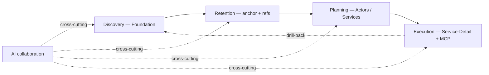
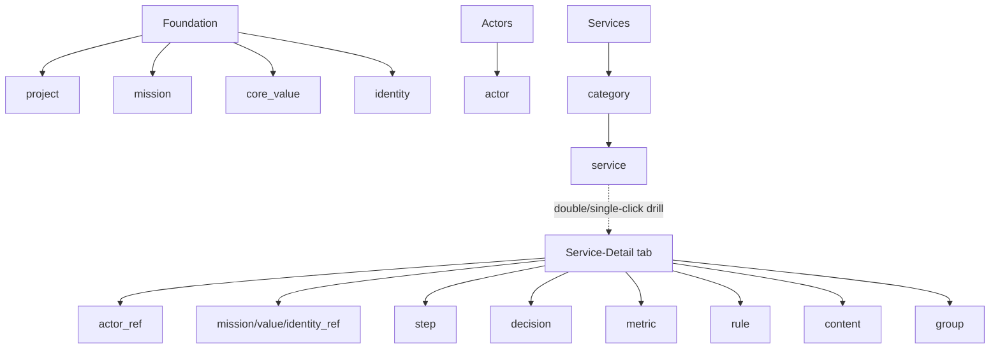
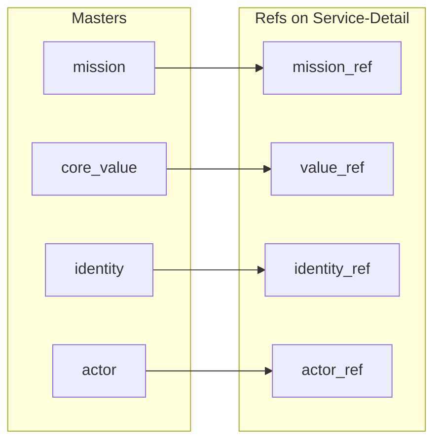

# BIG_PICTURE_REVIEW — product-concept skeleton review (discussion prep)

> **Status: PREP (2026-06-16).** This file is the agenda + current-state map
> for a deliberate, feature-pause review of Plot's concept skeleton. The
> **discussion happens next session**; this document is built *for* that
> discussion. User direction (2026-06-15): "큰 그림을 다시 한번 리뷰하고
> 다듬고 가야할 것 같아요" + (2026-06-16) "이거 토론이 될 거예요. 토론
> 결과를 [이 파일에] 기록합시다."
>
> **Not a decision doc yet.** Nothing here changes VISION / PHILOSOPHY /
> PRODUCT_SPEC / SPEC until the discussion produces a `D-YYYY-MM-DD-X` entry.
> The "현 상태 (current)" blocks are sourced from today's docs; the "토론 안건
> (open)" blocks are the questions to debate; the "결정 (decision)" slots are
> filled live during the discussion.

---

## 0. How to use this file

For each topic:

- **현 상태 (current)** — what the docs/code say *today*, with source links.
  Read-only reference; do not debate the facts, debate what they *should* be.
- **토론 안건 (open)** — the sharp questions / tensions. This is the agenda.
- **결정 (decision)** — _empty until the discussion. Record the outcome + a
  one-line rationale here, then mirror it to a `D-` entry + the owning doc._

The cross-cutting tensions in **§9** are the highest-value material — they are
places where the docs already disagree with each other or with the shipped
reality. Resolving those is most of the win.

---

## 1. The anchor (the lens for every decision)

**Essence ([VISION.md](./VISION.md)):** "Plot 은 본질을 모르는 사람이 본질을
찾고, 그걸 놓치지 않으면서, 그 본질 아래에서 서비스를 쉽게 기획·개발할 수 있게
AI 와 협업하는 툴이다."

**Three-phase cycle:** Discovery (Foundation) → Retention (anchor + refs) →
Execution (Actors → Services → Service-Detail + MCP). Reversible
(drill-back). Every topic below must trace to one of these.

> Rule for the discussion: when two options conflict, the one that better
> serves this sentence wins. If a topic doesn't serve any phase, that's itself
> a finding.

---

## 1.5 진행 상태 — Foundation 토론 시작됨 (2026-06-16, 다음 세션 계속)

토론을 Foundation부터 시작함. 아래 3개 쟁점 + 조수(Claude) 입장까지 나옴.
**아직 사용자 결정 없음 (전부 미결).** 다음 세션은 여기서 이어감 — 쟁점 1부터.

근거 사실(이번에 확인): **인터뷰/Discovery 흐름은 코드에 전혀 구현 안 됨**
(`grep -ri interview viewer/src plot_mcp` → 0건). Foundation = 현재 타입드 폼
(project + mission + core_value + identity) + ⓘ 개념 팝오버(`FOUNDATION_CONCEPT.md`).

- **쟁점 F1 — Foundation의 정체: "발견" vs "폼 채우기".** VISION 첫 문장은
  "본질을 *모르는* 사람이 *찾게*"인데 현재는 아는 사람이 채우는 폼. 인터뷰 미구현.
  - (A) 발견을 실제로 짓는다 — Pencil 모델이니 외부 에이전트가 MCP로 인터뷰
    (Plot 스킬/MCP 프롬프트). VISION 첫 문장 사수, Notion과 차별점. 비용=인터뷰 설계.
  - (B) "발견" 주장 내림 — Foundation = 본질을 *안 놓치게 붙잡는* 곳(Retention 중심).
    폼이 정직해짐. 비용=VISION 첫 문장 약화.
  - _조수 입장(미결): (A) MCP 인터뷰._
- **쟁점 F2 — "본질(本質)"이 빠진 1급 개념인가?** Foundation에 본질 노드 없음;
  mission/value/identity에 흩어져 암시됨. 본질 = mission인가, mission 위 무엇인가?
  후보 ① mission.why/direction가 사실상 본질(추가불요) ② project 앵커가 본질 한 문장 품음.
  _조수 입장(미결): 1급으로 올릴 가치 있음, ①/② 중 미정._
- **쟁점 F3 — Pencil 모델에서 identity의 자리.** identity="에이전트가 모방할
  보이스/톤"인데 이제 에이전트는 사용자 외부 에이전트(MCP). _조수 입장(미결): identity
  유지(보이스≠decision-value, 외부 에이전트 카피에 고가치), 단 프레이밍 전환("내장 AI
  페르소나"→"누구든 맞출 브랜드 보이스") = 작은 문서 수정._
- **쟁점 F4 — 단일 캔버스 vs 청중 분리.** _조수 입장: 현행 유지(가벼움)._

> 다음 세션 진행: F1 사용자 결정 → F2 → F3 → §11 로그 + `D-` 엔트리. 그 다음 캔버스(Actors)로.

---

## 2. T1 — Plot's philosophy & identity

**현 상태:**
- Value theory ([PHILOSOPHY.md](./PHILOSOPHY.md)): a service = "a device that
  produces value that didn't exist before, through the interaction of multiple
  actors." 10 principles (P1 relational · P2 plural · P3 asymmetric · P4
  emergent surplus · P5 service = hub-node not edge · P6 arrows carry
  verb+value+direction · P7 two conceptual planes · P8 CE before ME · P9
  general before specific · P10 expression before classification).
- Identity ([IDENTITY.md](./IDENTITY.md)): Plot is **NOT** a mindmap /
  diagram / prose tool; it **IS** "a strategic operations design + alignment
  tool." 4 use-purposes: concrete service planning, direction alignment,
  position-in-big-picture, relationship visualisation. Two modes: Mode 1 "The
  Picture" (today), Mode 2 "time-axis work-items" (future).

**토론 안건:**
1. **Identity vs vocabulary clash.** [PRODUCT_SPEC §1](./PRODUCT_SPEC.md) calls
   Plot "a mindmap-based planning tool" (mindmap = user-facing word, graph =
   internal) — IDENTITY.md says "NOT a mindmap." Is the "mindmap" framing still
   right for users, or does it actively mislead (pull toward brainstorming)?
   One sentence the whole team + the AI can repeat?
2. **Is the 10-principle set still the canon?** PHILOSOPHY is dated 2026-04-20,
   pre-Pencil-model, pre-15→17-kind growth. Which principles are load-bearing
   today, which are historical? (P7 "two planes" already softened to "same 2D
   plane, kind-distinguished" — [SketchCanvas](../viewer/src/canvases/SketchCanvas.tsx)
   note.)
3. **Pencil model vs interview model.** The overhaul pins "app = canvas + MCP
   surface, AI hosted externally (Pencil model)"; PRODUCT_SPEC §9 pins
   "canvas-via-conversation: every canvas's first draft comes from an agent
   interview" as the *primary* loop. Which is the real primary interaction?
   (See §9-E.)

**결정:** _(다음 세션)_

---

## 3. T2 — Per-canvas philosophy

**현 상태 ([CONCEPTS.md](./CONCEPTS.md) Canvases table, [SPEC.md](./SPEC.md)):**

| Canvas | Asks (phase) | Holds |
|---|---|---|
| Foundation | "Who are we, why exist?" (Discovery) | project, mission, core_value, identity |
| Actors | "Who participates?" (Planning) | actor |
| Services | "What value do we create/exchange?" (Planning) | project, category, service |
| Service-Detail | "How does this one service work inside?" (Execution) | actor_ref, mission_ref, value_ref, identity_ref, metric, step, decision, rule, content, group |

- Services hierarchy is exactly 2 levels: `category → service` (no sub-service).
- Service-Detail is now an inline **dynamic tab** (was modal), with the service
  as the **implicit subject** (no node on the canvas), its read-only inspector
  in the right panel (Option 1, D-2026-06-15-O).

**토론 안건:**
1. **Does each canvas have one sharp question it forces?** Foundation/Actors
   read clean; Services vs Service-Detail boundary — is "overview vs internals"
   the right cut, or is Service-Detail carrying too much (refs + flow + steps +
   rules + metrics + decisions + groups)?
2. **Services canvas content.** Today Services holds only project/category/
   service; all composition lives in detail. Right? Or should some
   cross-service value-flow live on the overview (PHILOSOPHY P5/P6 user
   journey = service→service edges, [PRODUCT_SPEC §7](./PRODUCT_SPEC.md))?
3. **Service-Detail subject.** The service is implicit (D-2026-05-28-B) + shown
   read-only (Option 1). Is "no service node on its own detail canvas" still
   right, now that the read-only inspector exists?
4. **Foundation single canvas** holds mission+core_value+identity (3 audiences:
   human/human/agent). Keep unified, or has the identity-vs-mission audience
   split earned its own surface?

**결정:** _(다음 세션)_

---

## 4. T3 — Node concepts (kinds, entity vs value-object, fields, MECE)

**현 상태:** **17 kinds** (the docs still say "15" in places — stale): project,
mission, core_value, identity, actor, category, service, actor_ref,
mission_ref, value_ref, identity_ref, metric, step, decision, rule, content,
group. Entity/VO split + bounded contexts in [DOMAIN.md](./DOMAIN.md). Symbol
model: the 5 master kinds (mission/core_value/identity/actor) + 4 `*_ref`
aliases ([CONCEPTS.md](./CONCEPTS.md) Symbol section).

- Recent changes (this week) **not yet reflected in CONCEPTS.md**:
  - `actor` is **identity-only** now — `motivation`/`pain` moved off the actor
    onto `actor_ref` (per-service stake), D-2026-06-15-J. CONCEPTS.md line ~230
    still lists motivation/pain *on actor*.
  - `actor_ref` carries per-service `gives`/`receives` + `motivation`/`pain`.
  - `service` gained `problem` (the service = anchor of a problem-solving
    process), D-2026-06-15-K.

**토론 안건:**
1. **MECE audit of 17 kinds.** Any overlaps to merge or gaps to fill?
   Candidates to scrutinise: `category` (Services grouping) vs `group`
   (ServiceDetail flow chunk) — MECE? `decision` vs `step` (D-2026-05-30-C
   split them) — still right? `rule` (policy+permission+SLA) — too broad?
2. **Entity vs value-object** — is every kind in the right column
   ([DOMAIN.md](./DOMAIN.md) table)? `actor_ref` is a VO embedded per service;
   confirm.
3. **service.problem vs mission/value** — does "problem" overlap with
   Foundation's "why"? Where's the line between project-essence and
   service-problem?
4. **Fields per kind** — rich-template/minimal-required is the rule
   ([CONCEPTS.md](./CONCEPTS.md) DP2). Are the hard floors (≥2 actors, explicit
   operator, service-under-category) still the right (and only) floors?
5. **Doc-sync task** — CONCEPTS.md must be brought current (actor identity-only,
   actor_ref stake, service.problem, 17 kinds, decision/group). Outcome of this
   topic feeds that rewrite.

**결정:** _(다음 세션)_

---

## 5. T4 — Chat context management

**현 상태 ([CHAT_ARCH.md](./CHAT_ARCH.md), SPEC §R7):**
- 3 layers: thread partitioning (per scope), context injection (active canvas +
  selection preamble), per-canvas system framing (phase → framing).
- Scope = `CanvasKind ∪ {project}`; `service_detail:<id>` parametric.
- **Just changed (this session):** chat keyed on the **active project path**
  (per project × canvas), D-2026-06-16-G; selection works on the
  service-detail canvas, D-2026-06-16-F. Model display+selection per provider
  (D-2026-06-16-C). UI reshaped to a chat-app layout (D-2026-06-16-D).
- Pencil model: in-app chat = thin launcher; the **primary** path is the user's
  own external agent over MCP (`get_viewer_context`). MCP-path selection/framing
  is partial (named follow-up).

**토론 안건:**
1. **Scoping model — is (project × canvas) right?** Now per active project +
   canvas + the project/canvas/service_detail/foundation/actors scopes. Any
   missing axis (e.g. per-node thread)? Any too-fine (thread sprawl)?
2. **Context the agent should get.** Today: active canvas + selection (cap 20) +
   phase framing, in-app only. What's the *right* context envelope for the MCP
   (primary) path — selection bridge, forest-anchored graph-RAG
   ([ROADMAP] Track 5.4), essence summary?
3. **Continuity vs coherence tradeoff** (CHAT_ARCH A7): per-area threads stay
   coherent but fragment memory across canvases. Worth a cross-thread "essence
   summary" preamble?
4. **In-app chat's job.** With Pencil model, is the in-app chat a real
   surface or a launcher? How much should it invest vs pushing users to their
   own agent?

**결정:** _(다음 세션)_

---

## 6. T5 — Outputs (publish / blueprint / `.noory/`)

**현 상태:**
- **Publish** (per-node): a node's typed text → MD export + a git commit with
  `Publish-*` trailers; version MAJOR bump (SPEC §Publish, [PRODUCT_SPEC §15](./PRODUCT_SPEC.md)).
- **Blueprint publish:** a project-level "📤 설계도 발행" action +
  `blueprint_version` (`v0.1.0`), shown on CanvasTabs.
- **`.noory/` layout (R9):** per-project artefacts under
  `<project>/.noory/plot/{project}/…`; chat config now also per-project
  `.noory/plot/chat-provider` (D-2026-06-16-G).
- MD-storage direction ([PRODUCT_SPEC §15](./PRODUCT_SPEC.md)): JSON = SSOT,
  MD = a *published export* (not co-equal). Half-migrated (Phase 1 of 6 done).

**토론 안건:**
1. **What is "publish" for?** Per-node MD export vs blueprint snapshot vs git
   tag — three "output" gestures. Are they one coherent story or three
   accreted ones? What does the user *get* from each?
2. **Audience of the output.** Who reads the published MD — the user, their
   agent, an external stakeholder? That decides format + location.
3. **`.noory/` structure** — is the per-project tree the final shape? (R9
   integration is done across plugins; confirm the plot layout.)
4. **Derived-MD migration** (PRODUCT_SPEC §15 Phases 2-6) — finish, re-scope,
   or drop? It's half-done and load-bearing for "publish."

**결정:** _(다음 세션)_

---

## 7. T6 — Versioning strategy

**현 상태 ([PRODUCT_SPEC §15](./PRODUCT_SPEC.md), SPEC §Publish):**
- **Per-node `version: vMAJOR.MINOR`** — MAJOR+1 on own publish; MINOR+1 when a
  descendant publishes (chain-propagated to ancestors); leaves = MAJOR only.
- **`blueprint_version`** — project-level, separate axis.
- **Snapshot ≡ git commit; session-tag = annotated tag** (PRODUCT_SPEC §6/§9).
- isomorphic-git not integrated; today subprocess git fires only on publish +
  tag (auto-commit/branch-per-proposal/PR-merge are *aspirational*).

**토론 안건:**
1. **Do three version axes coexist coherently?** per-node `version` +
   `blueprint_version` + git tags + a future `publish_baseline`. Which is the
   user-facing one? Can we collapse any?
2. **What does a version *mean* to the user?** "My service is at v3.0" — is that
   legible / useful, or internal bookkeeping?
3. **MINOR propagation** (ancestor chain) — does it earn its complexity?
4. **git model reality** — commit to the aspirational auto-commit + PR-style
   agent-proposal model (needs isomorphic-git), or formally narrow the spec to
   what ships (publish + tag only)? (See §9-C.)

**결정:** _(다음 세션)_

---

## 8. T7 — UI / UX

**현 상태:** 3-panel resizable workspace (chat | sidebar | canvas). Per-canvas
React Flow. Inspector (right) — per-kind, + Option 1 read-only service fallback.
Dynamic canvas tabs incl. service-detail. Theme tokens (light/dark), i18n
(en/ko). Chat reshaped to chat-app layout this session.

**토론 안건:**
1. **"이대로 괜찮은가" — full sweep vs ux-principles** (`~/.claude` ux:
   User-Centricity, Don't-Make-Me-Think, Consistency, Clear-Feedback, Visual
   Hierarchy 1-screen-1-CTA, Accessibility). Where does Plot violate them?
2. **Inspector** — per-kind inspectors are rich; is the editing surface
   (textareas, MD editor, composition lists) coherent or cluttered?
3. **Canvas affordances** — node chips, drill (single-click on Services drills,
   D-2026-06-15-H — keep?), hover/cursor, edge selection. Consistent mental
   model?
4. **Theme consistency** — after this session's dark-mode fixes (MD editor,
   labels), is anything still off-token?
5. **Onboarding / empty states** — the "agent interview fills the empty canvas"
   loop (PRODUCT_SPEC §9) isn't built; what does a new user actually see first?

**결정:** _(다음 세션)_

---

## 9. Cross-cutting tensions (the sharp stuff — resolve these first)

These are places where the docs already disagree with each other or with the
shipped reality. Each needs an explicit "keep design / accept reality / revise"
call.

- **A. Identity: "mindmap" vs "strategic tool."** PRODUCT_SPEC §1 ("mindmap")
  vs IDENTITY.md ("NOT a mindmap"). Reconcilable (mindmap = UI word) but the
  team needs one answer. → feeds T1.
- **B. MD storage: co-equal vs derived.** Shipped v0.13 = JSON+MD co-equal;
  PRODUCT_SPEC §15 = JSON-SSOT, MD-derived. Migration Phase 1/6 done, 2-6
  pending. → feeds T5/T6.
- **C. git / version-control: aspirational vs real.** PRODUCT_SPEC §6/§10/§11
  describe auto-commit + branch-per-agent-proposal + PR-style merge +
  isomorphic-git. Reality: subprocess git, only publish + tag commit; no
  branches, no isomorphic-git. Big gap. → feeds T6.
- **D. Work-item layer (Mode 2): designed, unbuilt.** PRODUCT_SPEC §10 +
  IDENTITY Mode 2 (userstory → task, provenance to commit SHA). A whole
  subsystem in the spec with zero implementation. Commit or shelve?
- **E. Interview-first vs Pencil MCP-first.** PRODUCT_SPEC §9 ("every canvas
  starts from an agent interview", primary loop) vs the overhaul's Pencil model
  (app = canvas + MCP, AI external, in-app chat = thin launcher). These imply
  different primary UX. → feeds T1/T4.
- **F. Doc staleness to repair** (bookkeeping, but real): "15 kinds" → 17;
  PHILOSOPHY "How v0.2 implements" table is v0.2-era (says "3 node kinds",
  "two bands"); CONCEPTS actor still lists motivation/pain (moved to
  actor_ref); `is_root` deprecated for actor. → feeds T3.
- **G. Pencil model supersedes PRODUCT_SPEC's embedded-agent assumptions**
  (§2 "MCP embedded in app", §9/§12 agent interview/embedded). PRODUCT_SPEC
  pre-dates the overhaul's Pencil decision. Which doc is authoritative where?

---

## 10. Diagrams

### Essence cycle (VISION)

### Canvas → kinds

### Symbol (master → reference) flow

---

## 11. Decisions log (filled during the discussion)

> One row per resolved question. After recording here, mirror to a
> `D-YYYY-MM-DD-X` entry in [DECISIONS.md](./DECISIONS.md) and update the owning
> doc (VISION / PHILOSOPHY / PRODUCT_SPEC / SPEC / CONCEPTS / DOMAIN).

| # | Topic | Decision | Rationale | D-id / doc updated |
|---|---|---|---|---|
| _(none yet — discussion is next session)_ | | | | |

---

## 12. Sources

[VISION.md](./VISION.md) · [PHILOSOPHY.md](./PHILOSOPHY.md) ·
[IDENTITY.md](./IDENTITY.md) · [PRODUCT_SPEC.md](./PRODUCT_SPEC.md) ·
[DOMAIN.md](./DOMAIN.md) · [CONCEPTS.md](./CONCEPTS.md) · [SPEC.md](./SPEC.md) ·
[CHAT_ARCH.md](./CHAT_ARCH.md) · [DECISIONS.md](./DECISIONS.md) ·
[ROADMAP.md](./ROADMAP.md)
