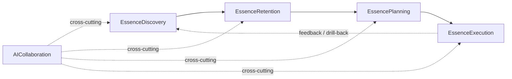
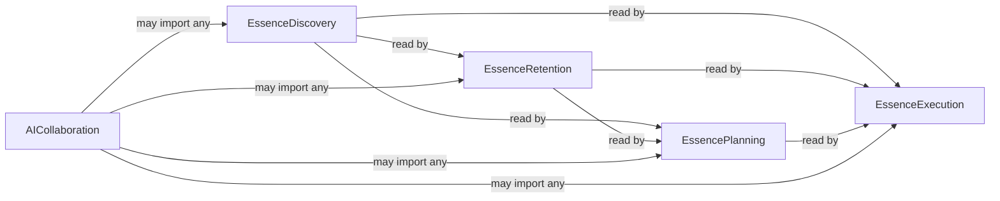

# Plot — DOMAIN model (bounded contexts, ubiquitous language, dependency direction)

> **Read after [`VISION.md`](../../../docs/VISION.md).** This file translates the
> three-phase essence cycle (Discovery / Retention / Execution) into
> bounded contexts that the code is organised around. When in doubt
> about *where* a piece of behaviour belongs, this file decides.

---

## Why this file exists

Cursor took six rounds across v0.13.3 → v0.13.10 because every fix had
to pick "where does this rule live?" without a domain map. Each round
chose a different ad-hoc location — CSS file / component / hook — and
the next bug surfaced in a slightly different ad-hoc location. The
override stack itself became the regression engine (see
[D-2026-05-10-C](./DECISIONS.md), [D-2026-05-10-F](./DECISIONS.md)).

DOMAIN.md prevents the recurrence by giving every concern an explicit
home. Before adding new behaviour, the implementer reads this file,
identifies the bounded context, and places the code there — not where
it's most convenient at the moment.

---

## Bounded contexts (5)

Each context corresponds to a phase of the [`VISION.md`](../../../docs/VISION.md)
cycle plus one cross-cutting context for the AI collaboration that
threads through every phase.

### 1. EssenceDiscovery — finding the essence
- **VISION phase:** Discovery (#1)
- **Surfaces:** Foundation canvas (mission / core_value / identity nodes),
  the Inspector's reduced fields (mission = declaration + body
  [D-2026-06-16-J](./DECISIONS.md); core_value = label + body
  [D-2026-06-16-M](./DECISIONS.md); identity = label + action-rule list
  [D-2026-06-16-N](./DECISIONS.md)/[O](./DECISIONS.md)), the per-canvas
  AI coach that interviews / proposes (every node is built through
  discussion, never a blank form or silent auto-fill —
  [D-2026-06-16-P](./DECISIONS.md)).
- **Owns:** the active-coach prompts that elicit the user's
  essence-language (discover → filter), the per-kind field schemas, the
  ⚠ badge that flags missing content.
- **Does NOT own:** how the discovered essence is rendered on later
  canvases (that's Retention) or how services derived from it are
  designed (that's Planning).
- **Code home (current):** `plot_mcp/foundation/`,
  `viewer/src/canvases/SketchInspector.tsx` (Foundation sections),
  `plot_mcp/templates/foundation/`.

### 2. EssenceRetention — keeping it visible
- **VISION phase:** Retention (#2)
- **Surfaces:** the synthetic project anchor injected on every primary
  canvas (Foundation / Actors / Services), the Foundation references
  now carried as **inspector chips on the service** (core_value +
  identity picked from Foundation, like actors —
  [D-2026-06-17-B](./DECISIONS.md)), the cross-canvas link semantics.
- **Owns:** anchor placement (`ProjectDoc.anchors[canvasKind]`), anchor
  visual differentiation (border, never outline — see D-2026-05-08-G),
  the anchor mutation routing through `onAnchorChange` (never through
  `onDocChange`), the read-side resolution of the service inspector's
  Foundation chips. The per-node `mission_ref` / `value_ref` /
  `identity_ref` kinds are retired — references live on the service
  inspector, not as canvas nodes ([D-2026-06-17-B](./DECISIONS.md)/[H](./DECISIONS.md)).
- **Does NOT own:** anchor's edit Inspector (that's Discovery's typed
  text), anchor click behaviour (open question per SPEC).
- **Code home (current):** `viewer/src/canvases/sketch/useNodesMemo.ts`
  (anchor injection), `viewer/src/canvases/sketch/applyAnchorChange.ts`,
  `plot_mcp/projects/anchors.py`.

### 3. EssencePlanning — designing the value-creation machinery
- **VISION phase:** Execution (#3, planning portion)
- **Surfaces:** Actors canvas (who participates — relational roles in
  a hierarchy, [D-2026-06-17-A](./DECISIONS.md)), Services overview
  (category / service / feature; selecting a service shows its 5-field
  inspector, a feature drills to detail —
  [D-2026-06-17-D](./DECISIONS.md)), the value-flow toggle that
  colours edges by `value_form`.
- **Owns:** actor / service / category / feature kinds, the actor
  hierarchy + its two edge types (hierarchy "is-a-kind-of" vs
  directed value-carrying relationship, [D-2026-06-17-A](./DECISIONS.md)),
  the service inspector's references (actors / core_values / identities)
  + typed "왜 필요한가?" / "뭐가 좋아지나?" ([D-2026-06-17-B](./DECISIONS.md)),
  the value-flow visual, the auto-layout algorithm (the "see the
  structure of the planned essence" gesture). There is no
  service→service edge concept ([D-2026-06-17-C](./DECISIONS.md)).
- **Does NOT own:** how individual features are decomposed (that's
  Execution / the feature canvas), how the user's free-form
  connections become formal exchange relationships (that's a future
  skill).
- **Code home (current):** `viewer/src/canvases/sketch/autoLayout.ts`,
  `viewer/src/canvases/sketch/useEdgesMemo.ts`,
  `plot_mcp/canvases/actors/`, `plot_mcp/canvases/services/`.

### 4. EssenceExecution — turning plans into reality
- **VISION phase:** Execution (#3, build portion)
- **Surfaces:** the feature canvas (what is today Service-Detail —
  the drill target moved from service to feature,
  [D-2026-06-17-D](./DECISIONS.md)/[G](./DECISIONS.md)) rendered as an
  actor-anchored behaviour flowchart, the step / decision / flow-edge /
  note / rule / actor_ref primitives, the MCP tools (`read`, `extend`,
  `reshape`) that let Claude operate on sketches as a collaborator
  while writing actual code.
- **Owns:** the feature canvas, its behaviour-flowchart primitives
  (`step`, `decision`, flow edges, `note`, `rule`),
  `actor_ref` decomposition, the MCP tool surface that exposes sketch
  graphs to Claude Code agents. The old `metric` / `content` / `group`
  primitives are retired ([D-2026-06-17-H](./DECISIONS.md)); `rule` is
  a per-feature operational constraint ([D-2026-06-17-E](./DECISIONS.md)).
- **Does NOT own:** the actual application code being built (that
  lives outside Plot). Plot's job ends at "Claude has the right
  context to write the code." Internal implementation logic (storage /
  queries / rendering) is below action-altitude — the user's AI
  agent's job ([D-2026-06-17-G](./DECISIONS.md)).
- **Code home (current):** `plot_mcp/canvases/service_detail/`,
  `plot_mcp/server.py` (MCP tool registration),
  `viewer/src/canvases/sketch/SketchModals.tsx` (drill modal).

### 5. AICollaboration — cross-cutting (interview / suggest / verify)
- **VISION phase:** all of them (cross-cutting)
- **Surfaces:** the MCP server entry points, the Sampling-driven
  interview flows (future), the auto-suggest features (future), the
  Plot-side skill manifests in `plot/skills/` and the agent
  definitions in `plot/agents/`.
- **Owns:** the *patterns* by which Claude participates — when to
  interview, when to anchor, when to propose, when to verify — and
  the Plot-side enforcement of those patterns (skills + hooks +
  sub-agents in `plot/`).
- **Does NOT own:** the user's choice of model, the conversation
  transcript (that's Claude Code's), the canvas data itself
  (that's owned by the other four contexts).
- **Code home (current):** `plot/skills/`, `plot/.claude-plugin/plugin.json`,
  `plot_mcp/server.py` (tool surface). Adds `plot/hooks/` and
  `plot/agents/` in v0.14.0.

---

## Ubiquitous language

Words mean **exactly one thing** across Plot code, docs, commits, and
conversation. When the same word means different things in different
contexts, rename the loser.

| Word | Meaning in Plot | Common confusion to avoid |
|---|---|---|
| **Node** | A graph entity in `CanvasDoc.nodes[]` (`SketchNode`). | Not a DOM node, not a React Flow internal node, not a `ReactFlow.Node` (which we call **rf-node** if it must be referenced). |
| **rf-node** | The React Flow runtime representation (`{ id, position, data }`). | Distinct from our `SketchNode`. The `useNodesMemo` hook is the boundary that converts one to the other. |
| **Anchor** | The synthetic project node injected by `useNodesMemo`, identified by `PROJECT_ANCHOR_ID` (`__project_anchor__`). | Not stored in `canvas.json`. Position lives in `ProjectDoc.anchors[canvasKind]`. |
| **Canvas** | One of the canvas kinds — project-level `foundation`, `actors`, `services` (overview), `entities` ([D-2026-06-17-I](./DECISIONS.md)), plus the per-feature `feature` detail canvas (what was `service_detail` — the drill target moved from service to feature, [D-2026-06-17-D](./DECISIONS.md)/[G](./DECISIONS.md)). | Not the HTML canvas element. |
| **Edge** | A connection in `CanvasDoc.edges[]` (`SketchEdge`). | Not the React Flow `rf-edge` (the runtime form). |
| **Service** | A `kind: "service"` node — the value-creation hub; shows a 5-field inspector ([D-2026-06-17-B](./DECISIONS.md)). | Not "REST service" or "microservice." |
| **Feature** | A `kind: "feature"` node nested under a service on the overview — a capability the service offers; the **drill target** ([D-2026-06-17-D](./DECISIONS.md)). | Not a `service` (a feature is not a multi-actor value exchange). |
| **Actor** | A `kind: "actor"` node — a relational role (not a person) in a hierarchy ([D-2026-06-17-A](./DECISIONS.md)). | Not a software actor (Akka-style), not a persona. |
| **Note** | A `kind: "note"` node — edgeless, canvas-global context read by the human and injected into the AI framing ([D-2026-06-17-F](./DECISIONS.md)). | Not a `content` node; it never gains an edge. |
| **Entity** | A `kind: "entity"` node on the AI-maintained Entities canvas — a project-wide data object (name + one-line "무엇을 담나"), [D-2026-06-17-I](./DECISIONS.md). | Not an ERD table; no fields / FKs / cardinality. |
| **Essence** | The user's articulated mission / core_value / identity, captured on Foundation. | Not a generic "vision" or "purpose." Specifically what Foundation surfaces. |
| **Hub** | A service node, per PHILOSOPHY P5. | Synonym for "service node," not for "anchor." |
| **Discovery / Retention / Execution** | The three phases of the VISION cycle. | Not generic software-development phases. |
| **Drill** | Drill into a **feature** to open its detail (behaviour-flowchart) canvas. Selecting a **service** shows its 5-field inspector — it no longer drills ([D-2026-06-17-D](./DECISIONS.md)). | Not "drill down" in a generic UI sense. |

---

## Entities vs value objects

| Concept | Entity / VO | Lives in | Identity by |
|---|---|---|---|
| `Project` | Entity | `ProjectDoc` | `id` (uuid) |
| `Canvas` | Entity | `CanvasDoc` | `(project_id, canvas_kind)` |
| `Node` (`SketchNode`) | Entity | `CanvasDoc.nodes[]` | `(canvas_id, id)` |
| `Edge` (`SketchEdge`) | Entity | `CanvasDoc.edges[]` | `(canvas_id, id)` |
| `AnchorPlacement` | Value Object | `ProjectDoc.anchors[canvasKind]` | by-value (no identity) |
| `Shape` | Value Object | enum on `SketchNode.shape` | by-value |
| `ValueForm` | Value Object | enum array on `SketchEdge.value_form` | by-value |
| `MdWarning` (string) | Value Object | `SketchNode._md_warnings[]` | by-value |
| `Direction` (T/R/B/L) | Value Object | `autoLayout.ts` runtime only | by-value |

---

## Dependency direction

Code in any context may depend on code in **lower-numbered** contexts
only. This keeps the cycle's drill-back semantics correct (Execution can
read Discovery; Discovery cannot reach into Execution).

**Forbidden imports (compile-time / review-time):**
- `EssenceExecution` files importing from a sibling `EssenceExecution`
  feature without going through `EssencePlanning` or
  `EssenceRetention` first — this would couple two execution paths
  through the wrong layer.
- `EssenceDiscovery` reading `EssencePlanning` data — Foundation must
  not depend on what services exist; if it must, route through
  Retention.

---

## Current code-to-domain map (gap list)

This is where today's code violates the model. Each row is a refactor
candidate with explicit cost and benefit. Refactors here are
prioritised in [`ARCHITECTURE.md`](./ARCHITECTURE.md).

| Where | Concern | Currently lives in | Belongs in | Severity |
|---|---|---|---|---|
| Anchor render | EssenceRetention | `viewer/src/canvases/sketch/useNodesMemo.ts` (mixed with regular node transform) | `EssenceRetention` (own module) | Med — works today; separation would clarify |
| Auto-layout algorithm | EssencePlanning | `viewer/src/canvases/sketch/autoLayout.ts` | `EssencePlanning` ✓ | None — already correct |
| Cursor SSOT | Cross-cutting (visual contract for the Discovery / Retention surface) | `viewer/src/styles.css` + `docs/CURSOR.md` | OK as-is — visual contract has no natural domain home | None |
| MCP tool registration | EssenceExecution + AICollaboration | `plot_mcp/server.py` | OK — tool surface IS the boundary | None |
| Inspector typed-text forms (Foundation) | EssenceDiscovery | `viewer/src/canvases/SketchInspector.tsx` (1422 LOC, mixed kinds) | `EssenceDiscovery` (Foundation slice) + `EssencePlanning` (Actors/Services slice) | High — the SI split is on the architecture roadmap |
| Service-Detail modal | EssenceExecution | `viewer/src/canvases/sketch/SketchModals.tsx` | `EssenceExecution` ✓ | Low — colocated with other modals; acceptable |
| Foundation refs (`mission_ref`, etc.) | EssenceRetention (read side) | scattered across `useNodesMemo`, picker components | Retired as node kinds; references move to the **service inspector chips** ([D-2026-06-17-B](./DECISIONS.md)/[H](./DECISIONS.md)) | Med — migration pending; remove the scattered `*_ref` node reads when the new inspector lands |

---

## Process — using this file

When implementing a feature or fixing a bug, apply this checklist:

1. **Re-read [VISION.md](../../../docs/VISION.md)'s first sentence.**
2. **Identify the phase** (Discovery / Retention / Planning / Execution
   / cross-cutting AICollaboration).
3. **Look up the bounded context** in this file's "Bounded contexts" section.
4. **Check the Code home** for that context. Add to existing files
   there; create a new file in that context's directory if no fit
   exists.
5. **Avoid forbidden imports** (per the dependency direction rules).
6. **Update this file's "Current code-to-domain map"** if the change
   moves an existing concern into its proper context (or moves it
   away from one — note as a regression to be paid back).

---

## When this file changes

DOMAIN.md changes when:
- A new bounded context is needed (rare; should be tied to a major
  VISION update).
- An existing context's responsibility is genuinely re-scoped (also
  rare; record as a `D-YYYY-MM-DD-X` decision).
- The current code-to-domain map gains or loses entries (frequent;
  bookkeeping).

A typo / clarification edit does not need a decision id, but it does
need to keep the dependency-direction diagram and the ubiquitous
language table internally consistent.
