# Stage Mermaid 설계도

이 문서는 Stage 설계도를 Mermaid 차트 중심으로 정리한다.

## 1. 전체 지도

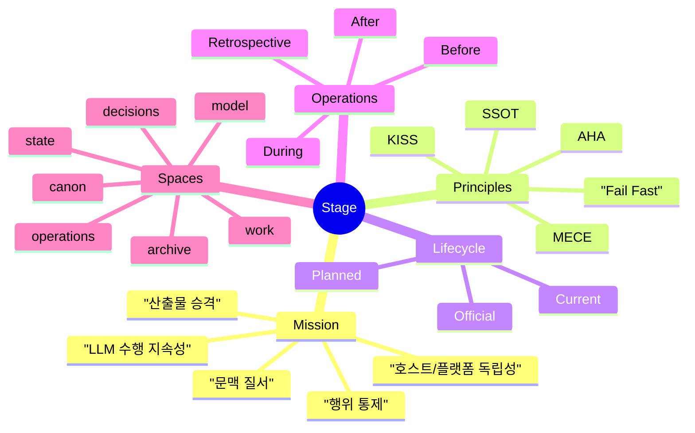

## 2. 큰 시간축

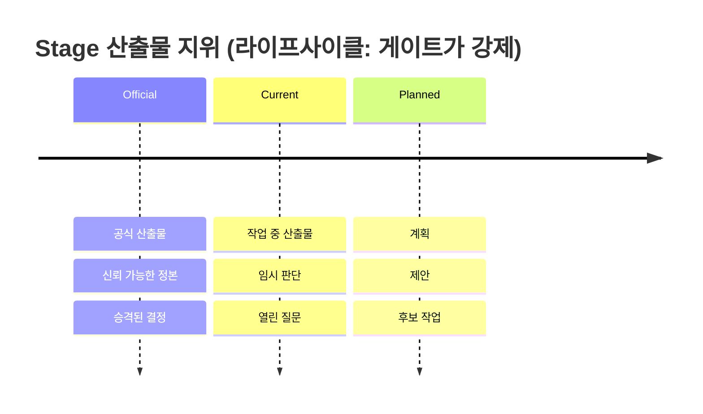

## 3. 개별 시간축

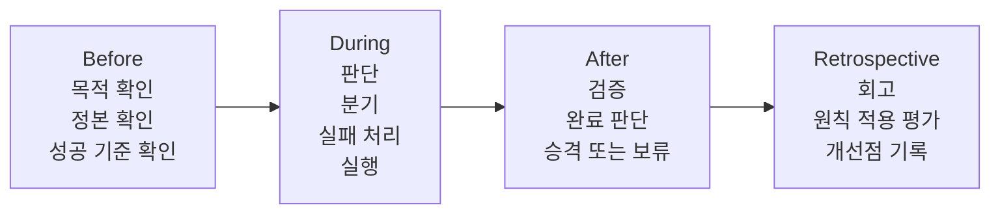

## 4. 공간축

```mermaid
flowchart TB
  Stage[".stage/"]

  Stage --> Official["official\n공식 지위 (승격된 정본)"]
  Stage --> Work["work\n작업 카드 라이프사이클"]
  Stage --> DecisionsF["decisions\npending 결정"]
  Stage --> State["state\n작업 중 상태"]
  Stage --> Proposals["proposals\n제안"]
  Stage --> Roadmap["roadmap\n테마 / 마일스톤"]
  Stage --> Operations["operations\n행위 규칙"]
  Stage --> Settings["settings.json\n거버넌스 범위\n광역 기본 + 제외 목록"]

  Official --> Canon["canon\n원칙 / 용어 / 불변 조건"]
  Official --> Model["model\n구조 / 경계 / 인터페이스"]
  Official --> Decisions["decisions\n승격된 결정"]
  Official --> Archive["work/archive\n보관된 작업 기록 + 회고"]

  Canon --> CanonRecords["*/\n개별 원칙 / 용어 / 불변 조건"]
  Model --> ModelRecords["components / boundaries / interfaces"]
  Decisions --> DecisionRecords["records\n개별 결정 SSOT (DE- id 유지)"]
  Archive --> ArchiveRecords["items / retrospectives\n보관 작업 기록과 회고"]

  Work --> Planned["planned\n계획 카드 + views (planned 보조 뷰)"]
  Work --> Current["current\nactive / review 카드"]
  Work --> Retros["retrospectives\n회고 기록"]
  Work --> WorkViews["active.md / review.md\ncurrent 뷰"]

  DecisionsF --> Pending["pending\n작업 중 결정 (DE-)"]

  State --> StateRecords["observations / questions / assumptions / risks\nwork_items로 작업 연결"]

  Roadmap --> RoadmapThemes["themes\nTH- 테마 (체인에서 상태 계산)"]
  Roadmap --> RoadmapMilestones["milestones\nM- 마일스톤 (닫기 시 기저 동결)"]
  Proposals --> ProposalRecords["P-\n개별 제안"]

  Operations --> BeforeOps["before"]
  Operations --> DuringOps["during"]
  Operations --> AfterOps["after"]
  Operations --> RetrospectiveOps["retrospective"]
  Operations --> OutputOps["output"]
  Operations --> ArtifactOps["artifacts"]
  Operations --> DocOps["documentation"]
  Operations --> VerifyOps["verification"]
  Operations --> BacklogOps["backlog"]
  Operations --> HookOps["hooks"]
```

## 5. 세 축의 결합

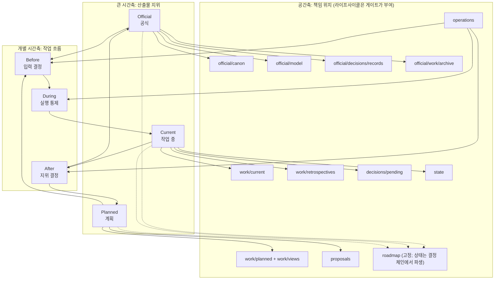

## 6. 작업 항목 상태 전이

작업 항목 상태 enum의 SSOT는 `operations/artifacts.md`다. `work/current/README.md`는 같은 값을 참조한다.

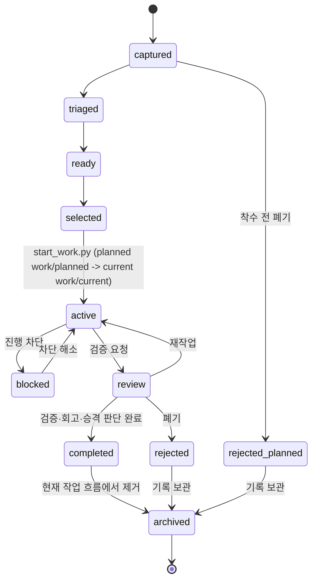

계획 단계(`captured`/`triaged`/`ready`/`selected`)는 `work/planned/`에 있고, `start_work.py`가
`work/current/`의 `active`로 이동시킨다. 착수 전 폐기(`rejected`)는 계획 카드에서도 일어난다.

`archived` 이동은 승격과 다르다. `official/work/archive/` 대상은 archive intent로 보관하며, rejected 작업도 보관할 수 있다.

## 7. 요청 처리 흐름

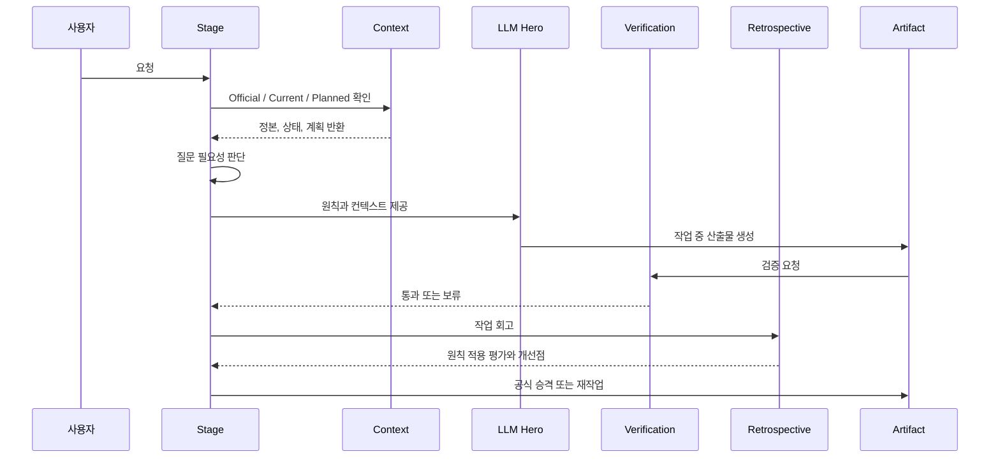

## 8. 원칙 적용 위치

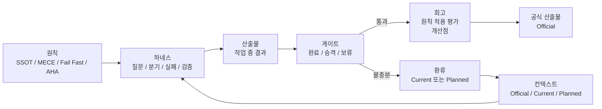

## 9. 의사결정 통제

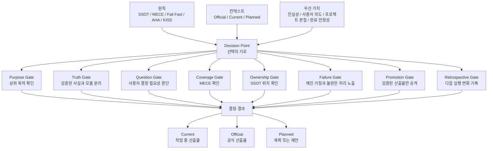

## 10. Stage 하네스의 두 축

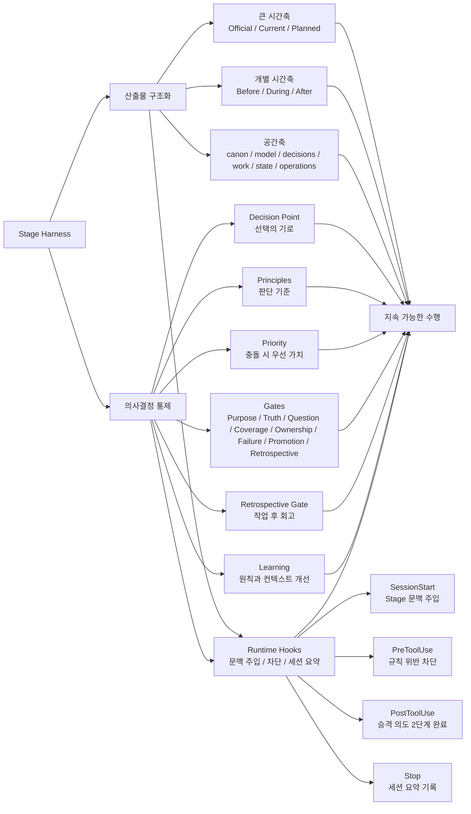

## 11. 첫 완성 단위

```mermaid
flowchart TB
  CompleteUnit["첫 완성 단위"]

  CompleteUnit --> Structure[".stage/ 산출물 구조"]
  CompleteUnit --> Routing["index.md 라우팅 규칙"]
  CompleteUnit --> ItemRecords["개별 산출물 파일\nitems / records / templates"]
  CompleteUnit --> ArtifactRules["operations/artifacts.md\n산출물 패밀리 규칙"]
  CompleteUnit --> Before["operations/before.md"]
  CompleteUnit --> During["operations/during.md"]
  CompleteUnit --> After["operations/after.md"]
  CompleteUnit --> Retrospective["operations/retrospective.md"]
  CompleteUnit --> Hooks["operations/hooks.md\nSessionStart / PreToolUse / Stop"]
  CompleteUnit --> Promotion["current -> official 승격 규칙"]
  CompleteUnit --> PlannedGuard["planned/proposals는 공식 진실이 아님"]
  CompleteUnit --> CompletionGate["부분 완료 금지\n첫 단위부터 닫힌 루프"]

  Structure --> ClosedLoop["닫힌 루프"]
  Routing --> ClosedLoop
  ItemRecords --> ClosedLoop
  ArtifactRules --> ClosedLoop
  Before --> ClosedLoop
  During --> ClosedLoop
  After --> ClosedLoop
  Retrospective --> ClosedLoop
  Hooks --> ClosedLoop
  Promotion --> ClosedLoop
  PlannedGuard --> ClosedLoop
  CompletionGate --> ClosedLoop
```

## 11-1. 산출물 패밀리 원칙

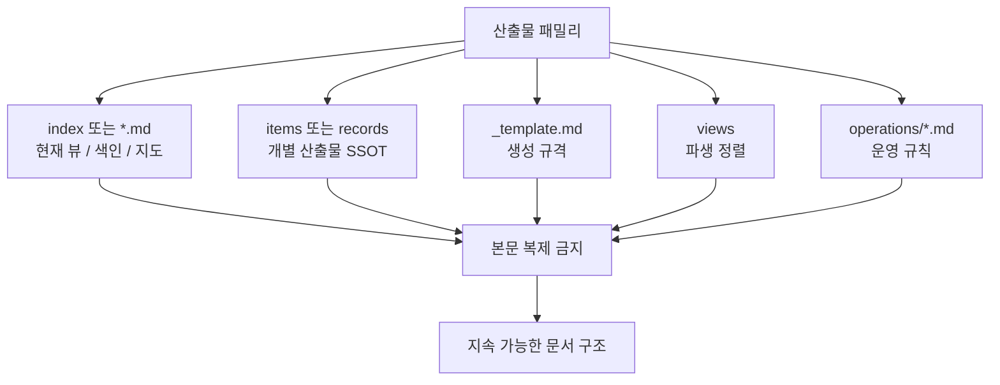

## 12. 완성도와 회고 게이트

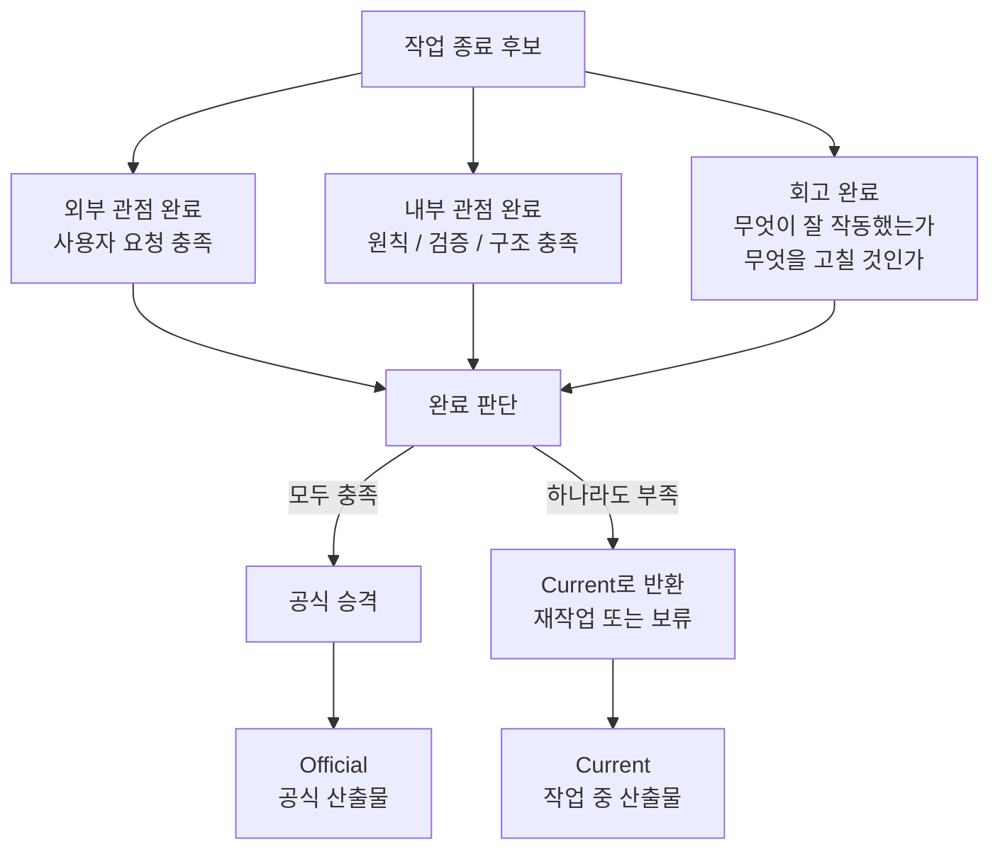

## 13. 호스트와 플랫폼 독립성

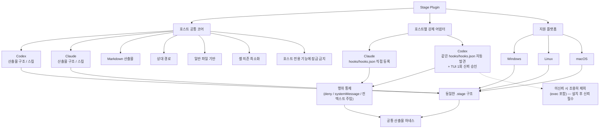

호스트 훅 계약(도구명 매핑 · 출력 규칙 · 신뢰 게이트)의 상세 정본은 `hooks/README.md` §Host contract.

## 14. 이식성 게이트

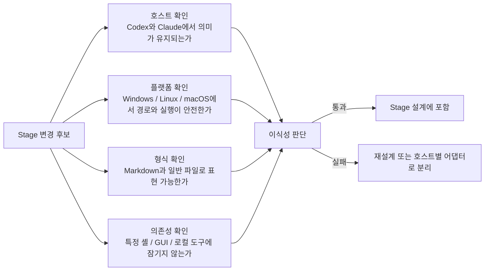

## 15. 훅 실행 게이트

```mermaid
flowchart TB
  Event["호스트 이벤트"]

  Event --> SessionStart["SessionStart"]
  Event --> PreToolUse["PreToolUse"]
  Event --> PostToolUse["PostToolUse"]
  Event --> Stop["Stop"]

  SessionStart --> Inject["Stage 문맥 주입\nplanned / current / official\n완료 게이트"]

  PreToolUse --> DeleteGate["삭제 게이트\n.stage 전체 삭제 차단\n등재 파일 삭제도 쓰기와 동일 게이트"]
  PreToolUse --> RegistrationGate["등재 게이트\n거버넌스 대상 수정 전 작업 항목 필요\n광역 기본 — 거의 모든 파일"]
  PreToolUse --> GovernanceGate["거버넌스 게이트\nsettings.json 파손 시 fail-closed"]
  PreToolUse --> HierarchyGate["계층 게이트\n부모 부재 / 자기 참조 /\n닫힌 부모 아래 자식 차단"]
  PreToolUse --> PromotionGate["승격 게이트\n대역 외 승격 의도 + promotes 바인딩\nrename 예약 (1단계)"]
  PreToolUse --> CommitGate["커밋 게이트\nstaged / git add / commit -a 대상 연결"]
  PreToolUse --> PortabilityGate["이식성 게이트\nOS 전용 스크립트 차단"]
  PreToolUse --> QuestionReminder["질문 게이트\n질문 전 목적·원칙 상기\n질문당 1회 리마인드"]

  PostToolUse --> IntentComplete["승격 의도 완료 (2단계)\nrename 예약을 확정, 차단 없음"]

  Audit["Audit CLI\n템플릿 / enum / 색인 / archive / 계층 / 계보 /\n결정 원칙 인용 / 거버넌스 / 정본 중복 /\n소유 경계 / 라우팅 검사"]

  Stop --> Summary["세션 요약 기록\n.stage/.runtime/sessions/세션별.md"]

  Inject --> Execution["일관된 수행"]
  DeleteGate --> Execution
  RegistrationGate --> Execution
  GovernanceGate --> Execution
  HierarchyGate --> Execution
  PromotionGate --> Execution
  CommitGate --> Execution
  PortabilityGate --> Execution
  QuestionReminder --> Execution
  IntentComplete --> Execution
  Audit --> Execution
  Summary --> Execution
```
