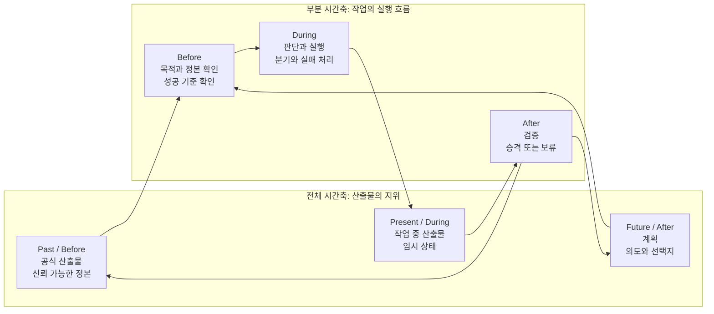
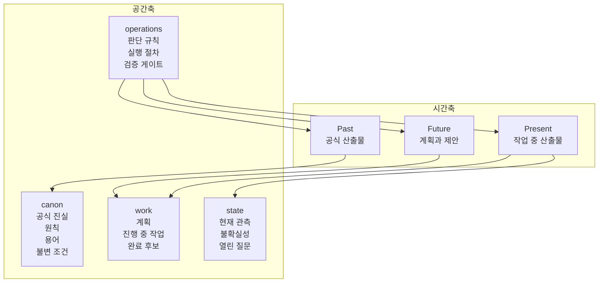
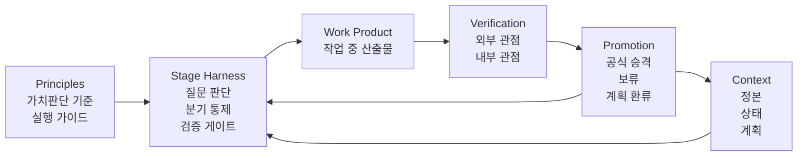
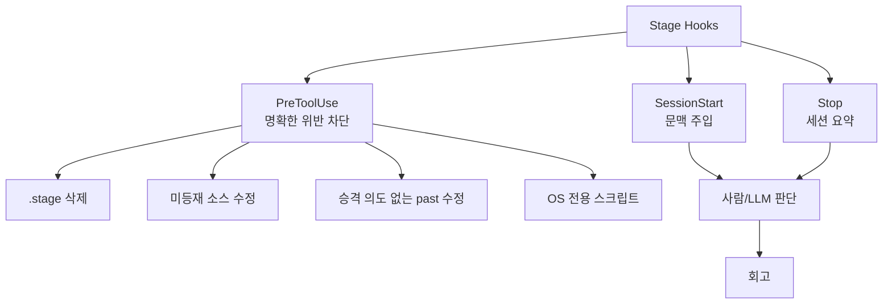

# Stage 토론 노트

이 파일은 Stage 설계를 확정하기 위한 문서가 아니다. 생각을 정리하고, 논점을
검토하고, 다음 토론으로 이어가기 위한 작업용 파일이다.

## 현재 논의의 중심

Stage는 단순한 문서 구조가 아니다.

현재 더 정확한 방향은 다음에 가깝다.

```text
Stage는 LLM (Large Language Model)의 장기 프로젝트 수행을 지속 가능하게 만드는 하네스다.
문서 구조는 그 하네스가 참조하는 정본 계층이다.
```

따라서 Stage가 다루는 대상은 세 가지다.

- 문맥: 무엇을 신뢰하고 어디에서 읽을 것인가
- 행위: 어떤 원칙으로 판단하고 실행할 것인가
- 승격: 무엇을 임시 상태에서 공식 산출물로 올릴 것인가

## 정리된 관점

### Hero와 Stage

LLM (Large Language Model)이 hero다.

Stage는 hero에게 새 능력을 붙이지 않는다. Stage는 hero가 장기 프로젝트 안에서
일관되게 판단하고 행동할 수 있도록 조건과 게이트를 제공한다.

### 문서 구조의 위치

문서 구조는 중요하지만 Stage의 전부는 아니다.

문서는 원칙, 사실, 결정, 상태, 절차의 정본 위치다. 하지만 원칙은 문서 안에만
있으면 부족하다. 실제 질문, 분기, 예외, 구현, 검증, 완료 판단에서 실행되어야
한다.

### 원칙의 역할

공유된 원칙들은 체크리스트가 아니라 행위 통제 기준이다.

예를 들어 MECE (Mutually Exclusive, Collectively Exhaustive)는 문서 분류뿐
아니라 작업 분해, 조건 분류, 실패 처리, 테스트 케이스, 완료 조건에도 적용된다.
SSOT (Single Source of Truth)도 문서 중복 방지만이 아니라 상태, 책임, 결정,
완료 기준의 소유권에도 적용된다.

## 공유 원칙의 사용 방향

### 약어

토론에서 쓰는 주요 약어는 다음 의미로 사용한다.

| 약어 | 의미 |
|---|---|
| LLM | Large Language Model |
| SSOT | Single Source of Truth |
| MECE | Mutually Exclusive, Collectively Exhaustive |
| AHA | Avoid Hasty Abstractions |
| DRY | Don't Repeat Yourself |
| KISS | Keep It Simple, Stupid |
| SOLID | Single Responsibility, Open-Closed, Liskov Substitution, Interface Segregation, Dependency Inversion |
| SoC | Separation of Concerns |
| SRP | Single Responsibility Principle |
| LoD | Law of Demeter |
| OCP | Open-Closed Principle |
| LSP | Liskov Substitution Principle |
| ISP | Interface Segregation Principle |
| DIP | Dependency Inversion Principle |
| DDD | Domain-Driven Design |
| TDD | Test-Driven Development |
| BDD | Behavior-Driven Development |
| F.I.R.S.T | Fast, Independent, Repeatable, Self-validating, Timely |
| UX | User Experience |
| API | Application Programming Interface |
| PR | Pull Request |

### 출력 원칙

사용자에게 설명하거나 옵션을 제시할 때 적용한다.

- 짧고 명확하게 말한다.
- 비유를 쓰지 않는다.
- 옵션은 제한하고 비교 기준을 붙인다.
- 결론과 질문을 분명히 한다.

### 질문 원칙

자율 실행 중 질문이 생길 때 적용한다.

질문하기 전에 먼저 상위 목적과 본질을 확인한다. 그 본질에서 답이 나오면 묻지
않는다. 그래도 사용자 결정이 필요한 경우에만 질문한다.

### 정직성 원칙

확인되지 않은 사실을 다룰 때 적용한다.

모르는 것은 모른다고 말한다. 경로, 명령, 스펙, 버전, API (Application
Programming Interface) 동작은 확인 없이 단언하지 않는다.

### 사고 원칙

분석, 코드, 설명, 문서, 답변 전체에 적용한다.

- MECE (Mutually Exclusive, Collectively Exhaustive): 겹침과 누락을 통제한다.
- SSOT (Single Source of Truth): 소유 위치를 하나로 둔다.
- Fail Fast: 잘못된 전제와 불완전한 상태를 조용히 통과시키지 않는다.
- AHA (Avoid Hasty Abstractions): 반복이 확인되기 전에는 성급히 체계화하지 않는다.

### 설계 원칙

구조, 책임, 추상화, 경계를 정할 때 적용한다.

도메인 경계와 SSOT (Single Source of Truth)는 초기에 엄격하게 잡는다. 잘못된
추상화는 중복보다 비용이 크다고 본다. SOLID (Single Responsibility,
Open-Closed, Liskov Substitution, Interface Segregation, Dependency Inversion)는
맥락 의존으로 적용하고, 과도한 분리는 KISS (Keep It Simple, Stupid) 위반으로
본다.

### 문서화 원칙

문서, 주석, SSOT (Single Source of Truth) 본문 작성에 적용한다.

본문은 항상 참인 현재 상태만 선언한다. 동기, 이력, 과거 사고는 본문이 아니라
결정 기록, 커밋, PR (Pull Request), 회고로 분리한다. 섹션과 식별자는 문제
상태가 아니라 산출물의 본질로 명명한다.

### 완료 원칙

완료를 선언하기 전에 적용한다.

외부 관점과 내부 관점이 모두 완료되어야 한다. 임시 통과와 부분 완료는 완료가
아니다. 검증되지 않은 결과는 공식 산출물로 승격하지 않는다.

## Stage 하네스 후보 흐름

현재 토론 기준으로는 다음 흐름이 자연스럽다.

```text
1. Purpose
   상위 목적과 본질을 확인한다.

2. Trust
   신뢰할 정본과 미확인 정보를 구분한다.

3. Question
   사용자에게 물어야 하는지 판단한다.

4. Plan
   작업과 케이스를 겹치지 않고 빠지지 않게 나눈다.

5. Act
   설계, 구현, 문서화, UX (User Experience) 판단에 원칙을 적용한다.

6. Verify
   테스트, 검증, 완료 조건을 확인한다.

7. Promote
   임시 결과를 공식 산출물로 승격할 수 있는지 판단한다.
```

## 원칙별 사용 케이스

이 섹션은 각 원칙이 Stage에서 어디에 쓰일 수 있는지 나열한 것이다. 일부 원칙은
독립 실행 단계가 아니라 다른 단계의 검증 기준으로만 쓰일 수 있다.

| 원칙 | 사용 케이스 | Stage에서의 형태 |
|---|---|---|
| `explanation_style` | 사용자에게 상황을 설명한다. 선택지를 제시한다. 진행 상태를 알린다. | 출력 게이트 |
| `behavior` | 불확실한 상태를 말한다. 임시 처리와 부분 완료를 막는다. 요청과 다른 실행을 방지한다. | 전역 행위 제약 |
| `question_protocol` | 작업 중 질문이 생긴다. 옵션을 제시하고 싶다. 사용자 결정이 필요한지 판단한다. | 질문 전 게이트 |
| `honesty` | 파일, 명령, 경로, 스펙, 버전, API (Application Programming Interface) 동작을 말한다. | 사실 검증 게이트 |
| `completion` | 작업 완료를 선언한다. 산출물을 공식 상태로 올린다. 중단 가능 여부를 판단한다. | 완료 게이트 |
| `plan_execution` | 계획을 세운 뒤 실행한다. 계획 변경이 필요하다. 범위를 벗어나는 일이 생긴다. | 계획 유지 게이트 |
| `MECE` | 작업을 나눈다. 조건을 분류한다. 실패 케이스를 다룬다. 테스트 범위를 정한다. | 커버리지 게이트 |
| `SSOT` | 사실, 상태, 책임, 기준, 결정의 소유 위치를 정한다. | 소유권 게이트 |
| `Fail Fast` | 전제가 불명확하다. 입력이 잘못됐다. 완료가 검증되지 않았다. | 조기 차단 게이트 |
| `AHA` | 새 추상화, 새 규칙, 새 문서 범주, 새 절차를 만들지 판단한다. | 승격 지연 게이트 |
| `DRY` | 중복이 누적된다. 같은 기준이 반복된다. 같은 처리 흐름이 여러 곳에 생긴다. | 중복 점검 기준 |
| `KISS` | 설계가 과해진다. 분리가 많아진다. 절차가 복잡해진다. | 단순성 점검 기준 |
| `SoC` | 책임 경계를 나눈다. 문서, 코드, 절차의 소유 범위를 정한다. | 책임 분리 기준 |
| `SRP` | 하나의 모듈, 문서, 절차가 여러 책임을 가진다. | 단일 책임 기준 |
| `LoD` | 직접 알 필요 없는 내부 구조에 의존한다. | 결합도 점검 기준 |
| `OCP` | 확장 가능성을 고려한다. 기존 동작을 깨지 않고 새 케이스를 추가한다. | 확장성 점검 기준 |
| `LSP` | 대체 가능한 구현이나 하위 타입이 기존 계약을 깨지 않는지 본다. | 계약 유지 기준 |
| `ISP` | 너무 큰 인터페이스나 절차가 생긴다. 사용하지 않는 의존이 생긴다. | 표면적 축소 기준 |
| `DIP` | 고수준 정책이 저수준 세부사항에 끌려간다. | 의존 방향 기준 |
| `Postel's Law` | 입력 수용 범위와 출력 엄격성을 정한다. | 관용/엄격 균형 기준 |
| `documentation` | 문서 본문을 쓴다. 주석을 쓴다. SSOT 본문을 갱신한다. | evergreen 문서 게이트 |
| `Clean Architecture` | 도메인 로직과 외부 세부사항의 경계를 정한다. | 아키텍처 경계 기준 |
| `DDD` | 도메인 용어, 경계, 모델을 정한다. | 도메인 정렬 기준 |
| `UX` | 사용자 대면 화면이나 흐름을 설계한다. | 사용자 경험 게이트 |
| `TDD` | 구현을 시작한다. 버그를 고친다. 새 동작을 추가한다. | 테스트 선행 게이트 |
| `BDD` | 사용자 행동 기준으로 기대 결과를 표현한다. | 행위 명세 기준 |
| `테스트 피라미드` | 검증 비용과 범위를 나눈다. | 검증 배치 기준 |
| `F.I.R.S.T` | 테스트 품질을 판단한다. | 테스트 품질 기준 |
| `pre_commit` | 작업을 커밋하거나 공식 산출물로 승격한다. | 승격 전 최종 게이트 |

## 원칙 충돌 후보

충돌은 원칙 자체가 틀려서 생기기보다, 같은 상황에 서로 다른 가치를 동시에
요구할 때 생긴다. 아래는 토론 후보이다.

| 충돌 후보 | 충돌 내용 | 검토할 질문 |
|---|---|---|
| `explanation_style` vs `honesty` | 짧게 말해야 하지만 불확실성, 검증 한계, 근거도 말해야 한다. | 짧음보다 정직성이 우선인가? |
| `question_protocol` vs `completion` | 질문을 줄이고 목적에서 답을 찾아야 하지만, 사용자 결정 없이는 완료할 수 없는 지점이 있다. | 언제 질문이 필수인가? |
| `plan_execution` vs `Fail Fast` | 계획 완수를 우선하지만, 중간에 전제가 깨지면 멈춰야 한다. | 계획 유지보다 전제 검증이 우선인가? |
| `DRY` vs `AHA` | 중복은 줄이고 싶지만, 성급한 추상화는 더 큰 비용을 만든다. | 몇 번의 반복부터 승격할 것인가? |
| `KISS` vs `OCP/DIP/ISP` | 단순하게 만들고 싶지만, 확장성과 의존성 분리를 위해 구조가 필요할 수 있다. | 현재 비용과 미래 변경 비용 중 무엇을 우선할 것인가? |
| `Postel's Law` vs `Fail Fast` | 입력을 관대하게 받아들이고 싶지만, 잘못된 상태는 빨리 드러내야 한다. | 관용의 범위는 어디까지인가? |
| `documentation` evergreen vs `decisions/history` | 본문은 현재 상태만 담아야 하지만, 왜 그렇게 됐는지도 보존해야 한다. | 본문과 이력의 경계를 어떻게 나눌 것인가? |
| `completion` vs `explanation_style` | 완료 판단에는 많은 검증 정보가 필요하지만, 출력은 짧아야 한다. | 검증 상세는 어디에 남기고 무엇만 말할 것인가? |
| `UX` vs `KISS` | 사용자 피드백과 접근성을 챙기면 구현이 늘어날 수 있다. | 사용자 대면 품질은 단순성보다 우선인가? |
| `TDD` vs 작은 문서/설정 변경 | 테스트 우선이 원칙이지만 모든 변경이 실행 테스트를 만들 수 있는 것은 아니다. | 테스트 대신 어떤 검증으로 충분한가? |

## 충돌 시 우선 가치 후보

이 우선순위는 확정안이 아니다. 충돌을 토론하기 위한 초안이다.

```text
1. 진실성
   확인되지 않은 것을 확정하지 않는다.

2. 사용자 의도
   사용자의 요청을 조용히 바꾸지 않는다.

3. 프로젝트 본질
   상위 SSOT (Single Source of Truth)와 목적에 맞는지 본다.

4. 안전한 완료
   외부 관점과 내부 관점이 모두 완료되어야 한다.

5. 지속 가능성
   다음 세션에서도 같은 기준으로 이어질 수 있어야 한다.

6. 단순성
   불필요한 구조와 절차를 만들지 않는다.

7. 속도
   위 가치들을 해치지 않는 범위에서 빠르게 한다.
```

토론할 핵심은 `단순성`과 `지속 가능성`의 순서다. Stage는 장기 프로젝트용
하네스이므로 지속 가능성을 높게 두는 것이 자연스럽지만, 잘못된 구조가 생기면
오히려 지속 가능성을 해칠 수 있다.

## 다음 토론 페이즈: 컨텍스트 구성

이번 토론의 대상은 원칙이다. 다음 토론의 대상은 컨텍스트다.

현재 이해는 다음과 같다.

```text
원칙은 가치판단의 기준이자 실행의 가이드다.
하지만 실행을 구체화하려면 컨텍스트가 필요하다.
```

따라서 다음 토론에서는 다음 질문을 다룬다.

- 컨텍스트는 어떤 단위로 구성해야 하는가?
- 컨텍스트에도 MECE (Mutually Exclusive, Collectively Exhaustive)와 SSOT (Single Source of Truth)가 적용되는가?
- 컨텍스트의 시간 축은 어떻게 나눌 것인가?
- 공식 컨텍스트와 임시 컨텍스트는 어떻게 구분할 것인가?
- LLM (Large Language Model)이 먼저 읽어야 하는 컨텍스트와 필요할 때 읽는 컨텍스트는 어떻게 나눌 것인가?
- 컨텍스트가 너무 많아질 때 압축, 요약, 참조, 폐기는 어떤 원칙으로 할 것인가?
- 컨텍스트를 구성하는 문서와 실제 실행 상태는 어떻게 동기화할 것인가?

## 전체 시간축과 부분 시간축

시간 흐름은 두 층으로 나누어야 한다.

```text
전체 시간축
  프로젝트 산출물의 시간적 지위

부분 시간축
  하나의 작업이 실행되는 흐름
```

전체 시간축은 무엇을 신뢰할 수 있는지 판단한다. 부분 시간축은 어떻게 일해야
하는지 판단한다.



## 시간축과 공간축의 연결

공간 축은 정보와 책임이 어디에 놓이는지 정한다.

```text
Canon
  공식 진실과 원칙

Work
  계획, 진행 중 작업, 완료 후보

State
  현재 관측, 열린 질문, 불확실성

Operations
  판단, 실행, 검증 규칙
```

시간축은 산출물의 지위를 정하고, 공간축은 그 산출물이 놓일 책임 위치를 정한다.



## Stage의 작동 구조

Stage는 원칙, 컨텍스트, 작업을 분리해서 다루지만 실행 시에는 하나의 루프로
엮는다.



이 그림에서 중요한 점은 Stage가 문서를 만드는 도구만이 아니라는 것이다.

```text
원칙은 판단 기준을 제공한다.
컨텍스트는 판단 재료를 제공한다.
하네스는 판단과 실행을 통제한다.
산출물은 검증 뒤에만 공식화된다.
```

## 훅으로 통제하는 범위

훅은 모든 원칙을 대신 판단하지 않는다. 자동 검출 가능한 위반을 사전에 막고,
나머지는 Stage 문맥과 회고 게이트로 사람이 판단하게 만든다.



## 보편성 — 하네스는 모든 종류의 작업을 커버한다 (2026-07-09 확정)

Stage의 작업 항목은 코드 변경이 아니라 책임 단위다. 기획, 디자인, QA, 운영 — 프로젝트가 하는
모든 작업이 같은 게이트를 지난다.

- 등재 게이트의 기본 범위는 **광역**이다 — 거의 모든 워크스페이스 파일이 거버넌스 대상이고,
  `.stage/`·`.git/`·`.discuss/`만 기본 제외다. 좁히려면 `settings.json`의 제외 목록을 쓰며,
  모든 협소화는 감사가 warning으로 드러낸다 (좁힘은 가능하되 보이게).
- `settings.json`이 존재하나 파손되면 fail-closed — 수리 전까지 `.stage` 밖 쓰기를 막는다.
- 검증(`passed`)의 의미는 작업 `kind`별로 `operations/verification.md`에 선언한다 —
  기획의 통과와 코드의 통과는 다른 사건이다. 기준 없는 kind 사용은 감사가 경고한다.

## 계층 — 모든 산출물은 하이라키하게 분류될 수 있어야 지속 가능하다 (2026-07-09 확정)

평면 디렉터리는 규모에서 분류 불능으로 붕괴한다. 계층은 뷰가 아니라 데이터(frontmatter)에
있어야 게이트와 감사가 탈 수 있다.

- 작업 항목과 백로그 항목은 `parent`로 계층을 이룬다. 위반(부모 부재, 자기 참조, 닫힌 부모
  아래 열린 자식)은 훅이 쓰기 시점에 차단하고, 감사가 순환까지 사후 검증한다.
- 축 간 계보: 백로그 `B` ↔ 작업 `W`는 `source`/`realized_by` 양방향 필드로 연결된다.
  `selected`인데 실행 작업이 없는 백로그는 감사가 경고한다.
- 상태 기록(질문·가정·위험·관찰)은 `work_items`로 영향받는 작업에 선택적으로 연결된다.
- ID는 8자리 제로 패딩(`W-00000001`) — 장기 규모에서 사전순이 생성순과 일치한다.
- 디렉터리 물리 분할은 규모 문제가 실재하기 전에는 도입하지 않는다 (AHA).

## 원칙 배선 — 원칙은 목록이 아니라 통제 기준이다 (2026-07-09 확정)

- `past/canon/principles.md`는 전체 원칙 카탈로그(사고·설계·방법론·행위·완료)이며, 각 원칙에
  "무엇을 통제하는가"가 붙는다. 사고·행위·완료 원칙은 하네스 코어로 고정된다 — 지우면 감사가
  실패한다. 설계·방법론·UX는 프로젝트가 조정한다.
- 결정 기록(`DE-*`)은 적용 원칙 인용이 필수다 — 빈 인용과 카탈로그 밖 인용은 감사 error다.
  (결정 기록의 단일 책임은 근거 보존이므로, SRP에서 도출된 규칙이다.)
- SessionStart는 코어 원칙 요약을 직접 주입한다 — 주입되지 않는 원칙은 런타임에 영향을
  미칠 수 없다.
- 질문 게이트: `AskUserQuestion` 직전에 훅이 1회 상기시킨다 — 목적과 원칙에서 답이 나오면
  묻지 말고 결정 후 한 줄 보고. 사용자 결정이 진짜 필요할 때만 재질문으로 통과한다.

## 아직 토론할 질문

- Stage는 질문을 줄이는 하네스인가, 질문의 질을 높이는 하네스인가?
- 어떤 원칙은 강제 게이트이고, 어떤 원칙은 판단 보조 기준인가?
- 문서 본문과 결정 기록의 경계는 어디까지 엄격해야 하는가?
- 자동 검출 범위 밖의 원칙 위반을 어떤 회고 양식으로 누적할 것인가?
- 다중 호스트/다중 세션이 같은 `.stage`를 공유할 때 런타임 상태를 어떻게 나눌 것인가? (P20)
